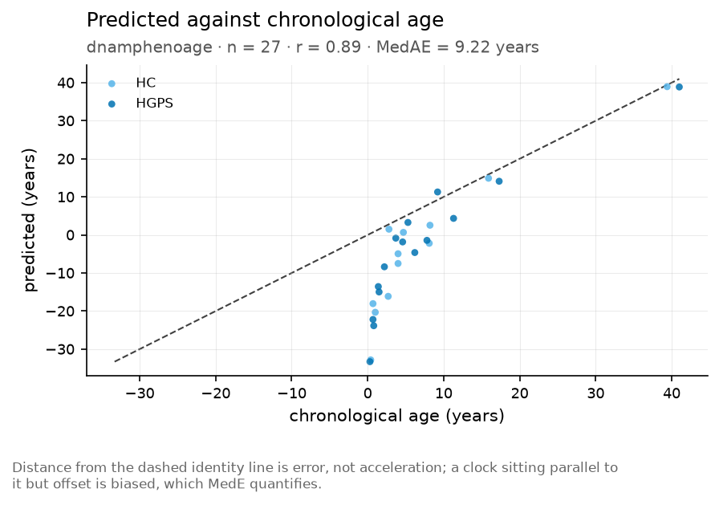
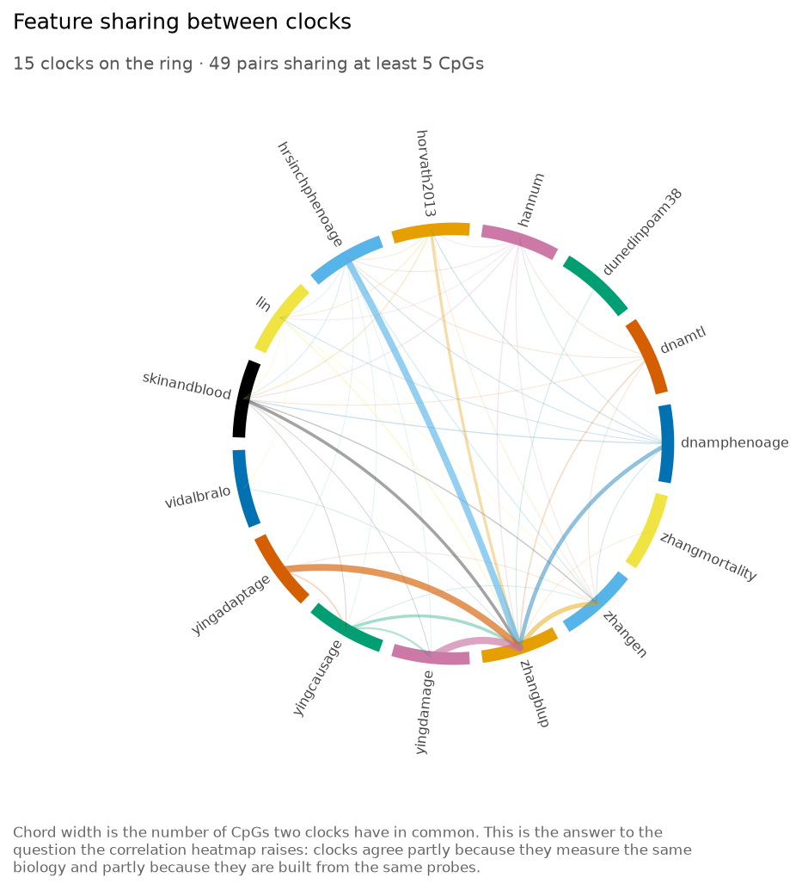

# FALCONAge 
<!-- badges: start -->
[](https://github.com/bhagesh-h/FALCONAge/actions/workflows/python-test.yaml)
[](https://github.com/bhagesh-h/FALCONAge/actions/workflows/R-CMD-check.yaml)
[](https://bhagesh-h.github.io/FALCONAge/)
[](https://www.python.org/)
[](https://www.r-project.org/)
[](https://www.gnu.org/licenses/gpl-3.0)
<!-- badges: end -->

**Documentation: <https://bhagesh-h.github.io/FALCONAge/>**

Biological age and aging-clock scoring from multiomic data, in Python and R, on CPU or GPU.

**F**ramework for **A**ging **CL**ocks, **O**mics **N**ormalisation and **Age** scoring.

Takes a public-database accession or a directory of raw files, normalises it, applies any of 161
published aging clocks, and returns a score per sample with the units, the provenance and the
fraction of features that had to be imputed. The R and Python interfaces run the same numerical
core, so they return the same numbers.

Every clock algorithm is implemented from scratch against its published description - no clock
implementation is imported from another package. Coefficients are a different matter: they are
fitted data, not a procedure, and 28 clocks have coefficients that are research-use-only or have
no traceable public source. Those ship as a complete, tested scaffold and need a coefficient file
you supply. See [§6](#6-clocks-that-need-author-permission).

## 1. Overview

An aging clock is a model that maps molecular measurements to a number on an age-like scale. What
that number means depends entirely on what the model was trained to predict, and the field has at
least six answers: chronological age, mortality, the rate of change across organ systems, causal
versus reactive methylation, stem-cell division count, and organ-specific decline. A tool that
returns "biological age = 57.3" without saying which of those it computed is not reporting a
result.

FALCONAge is built around that distinction. Every clock in the registry declares what it
predicts, in what unit, on what platform, in which species and population, and on what
`scale_type` - and the `scale_type` governs which downstream operations are permitted. Asking for
age acceleration on DunedinPACE raises an error rather than subtracting a chronological age from
a rate.

Four things it does:

- **Download** public data by accession alone - GEO, ArrayExpress, SRA/ENA, Zenodo and Hugging
  Face - returning files alongside a sample table with age and sex extracted from whatever
  free-text field held them.
- **Preprocess** raw IDATs or a public matrix into a scoreable one, with the normalisation choice
  recorded because it changes the answer.
- **Score** any number of clocks in one call, on CPU or GPU, with per-clock missingness reported
  before the numbers rather than after.
- **Analyse** - age acceleration in both conventions, Cox models with sex-standardised effect
  sizes, test-retest reliability, and the ComputAgeBench AA1/AA2 benchmark against
  aging-accelerating conditions.

### Why one tool for both languages

Methylation preprocessing lives in R (minfi, sesame, ChAMP). Deep-learning clocks and GPU
inference live in Python. Most groups run both and reconcile the results by hand.

FALCONAge has one numerical core, written in Python, and an R package that calls it through
reticulate. The R interface is native - S3 classes, `data.frame` in and out, roxygen2
documentation, ggplot2 figures - but the arithmetic happens in one place. The two languages
return identical values because they run identical code, and the test suite asserts bit equality
rather than approximate agreement.

### Where the numbers come from

Two things in a clock are commonly conflated, and separating them decides most of what follows.

The **architecture** is a procedure described in a paper - a dot product over selected CpGs, a
principal-component rotation, a two-stage Cox model. Every one is implemented here from scratch
from its published description: 15 preprocessing operations, 15 output transforms and 10 bespoke
forward passes, all written against the equations rather than ported from another package.

The **coefficients** are fitted data. Horvath's clock is its 353 CpG identifiers and their
weights, and there is no procedure that regenerates them without Horvath's training cohort. They
can only be obtained, and whether they can be redistributed varies by clock.

FALCONAge sources them from the primary publication wherever one exists, rather than copying
another package's file - which is also how the field acquired eleven documented disagreements
between what a paper reports and what its widely-used coefficient set contains. Where
redistribution is not permitted, the architecture still ships and you supply the numbers.

## 2. Installation

FALCONAge is **not on PyPI or CRAN yet**. Both packages install from this repository, and both
live in a subdirectory of it, so the commands below name that subdirectory. Everything works the
same once installed; only the source differs.

### Python

The Python package is in `python/`, which is what `#subdirectory=python` points at.

```bash
pip install "falconage @ git+https://github.com/bhagesh-h/FALCONAge.git#subdirectory=python"
```

Extras use the same URL with the extra in brackets:

```bash
pip install "falconage[methylation] @ git+https://github.com/bhagesh-h/FALCONAge.git#subdirectory=python"
pip install "falconage[all]         @ git+https://github.com/bhagesh-h/FALCONAge.git#subdirectory=python"
```

CUDA is the exception. The GPU extra pulls whatever `torch` build pip's default index offers,
which on Linux is the CUDA 12.x wheel and on Windows is the CPU one, so install `torch` yourself
against the index that matches your driver:

```bash
pip install torch --index-url https://download.pytorch.org/whl/cu124
pip install "falconage @ git+https://github.com/bhagesh-h/FALCONAge.git#subdirectory=python"
```

Pin a version by tagging the ref - `...FALCONAge.git@v1.0.0#subdirectory=python`. Do that in
anything you intend to reproduce: `main` moves, a tag does not.

For a checkout you intend to edit:

```bash
git clone https://github.com/bhagesh-h/FALCONAge.git
pip install -e "FALCONAge/python[dev]"
```

### R

The R package is in `r/`, hence `subdir`:

```r
# remotes
remotes::install_github("bhagesh-h/FALCONAge", subdir = "r")

# or pak, which resolves dependencies better and takes the subdirectory inline
pak::pak("bhagesh-h/FALCONAge/r")

# a specific version
remotes::install_github("bhagesh-h/FALCONAge@v1.0.0", subdir = "r")
```

Then, once:

```r
library(FALCONAge)
falconage_install()                    # creates the Python environment
falconage_install(gpu = TRUE)          # with CUDA
```

`falconage_install()` builds an isolated environment pinned to the Python core version that
matches your R package, using `uv` when it is available and `virtualenv` otherwise. It installs
the core from the same GitHub ref the R package was built from, so the two halves cannot drift.

```r
falconage_config()
#> FALCONAge 1.0.0 (R)
#>   python core   1.0.0  /home/x/.virtualenvs/r-falconage/bin/python
#>   torch         2.6.0  CUDA 12.4
#>   device        cpu     (cuda available; see §8 for why it is not the default)
#>   dtype         float64
#>   registry      1.0.0  (161 clocks: 23 ship, 110 untraced, 28 need a licence)
#>   cache         /home/x/.cache/falconage  (2.1 GB)
```

### Coefficients

Installing gets you every clock's algorithm. It does not get you every clock's coefficients,
because most of them are not the package's to distribute.

- **23 clocks work offline immediately.** Twenty ship a coefficient file; the other three —
  PhenoAge, KDM and homeostatic dysregulation - are formulas with no coefficients to ship.
- **110 are catalogued but score nothing yet.** Their metadata, feature counts and transform
  chains are recorded, but no primary source for the numbers has been established, so nothing is
  bundled. Copying a coefficient set out of another package without knowing where *that* package
  got it is how the eleven known paper-versus-implementation discrepancies spread.
- **28 need a file you obtain yourself.** The algorithm is implemented and tested; the numbers
  are research-use-only. [§6](#6-clocks-that-need-author-permission) lists all of them with a
  link to where each comes from.

```bash
falconage clocks list --tier A     # what works right now, no network
falconage clocks list --tier C     # what needs a licence, and where to get it
```

### Docker

No image is published yet. Build either one from the repository - both carry Python, R and the
CLI, and both run the build-time smoke test, so a broken image fails at build rather than at
first use:

```bash
git clone https://github.com/bhagesh-h/FALCONAge.git && cd FALCONAge
docker build -f docker/Dockerfile.cpu  -t falconage:1.0.0-cpu  .
docker build -f docker/Dockerfile.cuda -t falconage:1.0.0-cuda .
```

See §9 for running them.

## 3. Quick start

The same analysis, both languages, same numbers.

<table>
<tr><th>Python</th><th>R</th></tr>
<tr valign="top">
<td>

```python
import falconage as fa

# public data by accession
dl = fa.download("GSE40279")

# harmonise probe ids, detect
# the platform, clip betas
data = fa.prepare(dl.read())

# what each clock would lose
# on this array, before scoring
fa.probe_loss(data, clocks="scoreable")

# score
res = fa.score(
    data,
    clocks=["horvath2013", "hannum",
            "dnamphenoage"],
    device="auto",
)

res.summary()
res.interpretation()
fa.acceleration(res, method="both")

fa.plot.ba_vs_ca(res, "horvath2013")
fa.report.write_report(res, "report.html")
```

</td>
<td>

```r
library(FALCONAge)

# public data by accession
dl <- download("GSE40279")

# harmonise probe ids, detect
# the platform, clip betas
data <- prepare(read_betas(dl$files[[1]]))

# what each clock would lose
# on this array, before scoring
probe_loss(data, clocks = "scoreable")

# score
res <- score(
  data,
  clocks = c("horvath2013", "hannum",
             "dnamphenoage"),
  device = "auto"
)

summary(res)
interpretation(res)
acceleration(res, method = "both")

plot_ba_vs_ca(res, "horvath2013")
report(res, "report.html")
```

</td>
</tr>
</table>

Command line:

```bash
falconage download GSE40279 --dest data/
falconage preprocess data/GSE40279/ --out prepared.h5ad
falconage score prepared.h5ad --clocks horvath2013,hannum,dnamphenoage --outdir results/
falconage clocks --tier A            # what will actually run offline
```

The CLI verbs are `download`, `preprocess`, `score`, `clocks`, `bench`, `cache` and `config`.
Report writing is library-only for now — `fa.report.write_report(res, "report.html")`.

## 4. The four modules

### 4.1 Download

One verb, one accession.

```python
fa.download("GSE40279")                       # GEO series
fa.download("GSM989827")                      # GEO sample
fa.download("E-MTAB-11827")                   # ArrayExpress / BioStudies
fa.download("10.5281/zenodo.18763485")        # Zenodo, by DOI
fa.download("10.6084/m9.figshare.12345678")   # Figshare, by DOI
fa.download("PXD012345", extensions=[".tsv"]) # PRIDE proteomics
fa.download("MTBLS1234")                      # MetaboLights
fa.download("TCGA-BRCA")                      # GDC, open-access files
fa.download("PRJNA553602")                    # SRA / ENA -> run table
fa.download("owner/repo")                     # Hugging Face
```

The source is inferred from the shape of the accession. Two of these behave deliberately unlike
the others:

- **PRIDE refuses an unfiltered project** and prints the extensions present instead. Most of a
  PRIDE deposit is raw instrument output that no aging clock reads, and starting a
  multi-gigabyte transfer nobody sized is not a helpful default.
- **SRA stops at a run table**, in `result.run_table`, with the FASTQ URLs. Reads are not
  something a clock can score — they need alignment and methylation calling first, and that
  pipeline is not in this package. What it can usefully do is resolve the accession.

Figshare and Zenodo are told apart by DOI prefix rather than by asking one API and falling back
to the other, because a Figshare DOI sent to Zenodo returns a 404 that reads like a missing
record. Synapse, EGA, dbGaP and UK Biobank are credentialed and deliberately never automated —
the access agreement is yours, not the tool's, and `fa.download()` on one of those says so and
points at the portal rather than pretending to try.

Check before you commit to a transfer:

```python
fa.download("GSE40279", dry_run=True)         # file list and sizes, nothing transferred
```

Sample metadata is normalised into a common table regardless of source, and the module tells you
when it could not parse something rather than returning a half-empty age column:

```
WARNING  age extracted for 41/120 samples (34%) from 'characteristics_ch1'
         unparsed examples: "age at diagnosis: 54y", "AGE=54"
         supply a mapping, or edit the returned sample table directly
```

A wrong age is worse than a missing one, because age acceleration is measured against it.

Downloads are cached, resumable and checksum-verified:

```bash
falconage cache ls
falconage cache size
falconage cache gc --older-than 90d
```

### 4.2 Preprocess

```python
data = fa.prepare(
    fa.read_betas("data/GSE40279/betas.csv"),
    aggregate_epicv2=True,     # mandatory on EPIC v2
)
fa.qc(data)                    # missingness, beta distribution, sex check
```

`prepare()` takes a **beta matrix** and harmonises it: replicate-probe aggregation, probe-id
normalisation, platform detection from the probe pattern, and clipping to [0, 1]. Readers exist
for a beta CSV or Parquet (`read_betas`), a GEO series matrix (`read_series_matrix`) and RRBS
coverage files (`read_rrbs_dir`).

**Normalisation is not included, and this is a real limit rather than an omission to be inferred
from silence.** There is no `noob`, no `BMIQ`, no detection-p filter and no cross-reactive or SNP
probe mask in v1.0. IDAT intensities can be parsed (`io.read_idat_pair`) but turning addresses
into probe ids needs the Illumina manifest, which the package does not vendor. If your input is
raw IDATs, normalise with sesame or minfi first and bring the beta matrix here. See
[ROADMAP.md](ROADMAP.md) item 2.5.

EPIC v2 probe IDs carry replicate suffixes (`cg00000029_TC21`). Without aggregation every clock
sees zero overlapping features, so the module raises rather than returning an empty result.

Clinical chemistry requires units. There is no default and no inference from magnitude - a
creatinine of 80 is plausible as µmol/L and absurd as mg/dL, and guessing is how an 88× error
happens.

```python
data = fa.prepare_clinical(
    labs,
    units={"albumin": "g/dL", "creatinine": "mg/dL", "glucose": "mg/dL",
           "crp": "mg/L", "alp": "U/L"},
)
```

Check coverage before scoring, not after:

```python
qc = fa.qc(data)
print(qc.clock_coverage)
#> clock          n_features  n_present  coverage
#> dnamphenoage          513        511     0.996
#> skinandblood          391        385     0.985
#> dunedinpoam38          46         44     0.957
#> horvath2013           353        333     0.943
#> hannum                 71         63     0.887
```

### 4.3 Score

```python
res = fa.score(data, clocks="compatible")     # only clocks that actually match the data
res = fa.score(data, clocks="all")            # everything, with warnings
res = fa.score(data, clocks=["grimage2"], device="cuda", dtype="float32")
```

`"compatible"` is the default. The registry holds clocks for several species, platforms and
molecular layers, and most do not apply to any given dataset. Running all of them produces a
table whose majority of rows were computed almost entirely from imputed reference values, which
looks like a result and is not one.

Every row carries its provenance:

```python
res.long().columns
#> sample_id, clock, value, unit, scale_type, generation, predicts, n_features,
#> coverage, mass_coverage, n_imputed, availability, registry_version,
#> falconage_version
```

#### Two coverage numbers, not one

`coverage` counts features. `mass_coverage` weighs them — the share of the model's total
|coefficient| carried by the features you actually have. An elastic net's weights are nothing
like uniform, so 92% feature coverage covers both "the missing 8% are negligible" and "the
missing 8% carry a third of the model", and those give very different numbers.

The coverage floor applies to both, and the error says which one failed:

```
FeatureCoverageError: horvath2013: 96.3% of features are present, but they carry
only 61.2% of the model's total |coefficient| -- below the 80% floor.
  Heaviest absent features: cg16867657 (14.1%), cg24724428 (9.7%), cg06639320 (6.2%).
  Feature count alone would have passed this dataset. The probes that are
  missing are the ones the clock leans on.
```

This is the mechanism behind EPIC v2 probe loss shifting the first-generation clocks while the
principal-component versions barely move. To see it before committing to a run:

```python
fa.probe_loss(data, clocks="scoreable")   # per clock, worst by weight first
```

#### How to read a result

```python
res.interpretation()
#> per clock: scale_type, unit, legal_operations, coverage, mass_coverage,
#>            technical_icc, biological_icc, reliability_note, caveats, tier
```

`caveats` carries the documented disagreements between a clock's paper and the coefficients that
circulate for it — eleven of them, surfaced as warnings at score time rather than left in prose.
`technical_icc` and `biological_icc` are separate columns on purpose: they do not track together,
and the clocks most used in intervention work are where the gap is widest.

### 4.4 Analyse

```python
fa.acceleration(res, method="both")                       # absolute and residual, side by side
fa.acceleration(res, adjust="cell_composition")           # net of blood cell mix
fa.cox_hazard(res, time_col="time", event_col="status")   # HR per SD
fa.icc(values, subject_col="subject", value_col="value")  # test-retest reliability
fa.run_benchmark(res, condition_col="condition", control="HC")
```

`adjust="cell_composition"` regresses out the deconvolution clocks scored in the same run. It
matters because cell composition changes with age and with everything else: across more than
10,000 blood samples, immune composition was significantly associated with age acceleration for
every one of six widely used clocks. An unadjusted acceleration measures two things and reports
one number. `adjust=["cd8t", "mono"]` uses measured counts from `obs` instead, and the returned
frame records what it was adjusted for.

## 5. Clock catalogue

161 clocks in v1.0 - the 159 DNA-methylation and clinical-chemistry entries in the catalogued
registry, plus KDM and homeostatic dysregulation. Browse them:

```python
fa.registry.list()
fa.registry.filter(generation="second", tissue="whole_blood")
fa.registry.search("mortality")
fa.registry.compatible_with(data)
fa.registry.get("grimage2")
```

```bash
falconage clocks list --data-type dna_methylation --generation second
falconage clocks info grimage2
falconage clocks cite grimage2 --style bibtex
```

| Category | n | Trained on | Examples |
|---|---|---|---|
| First generation | 45 | chronological age | Horvath 2013, Hannum, Lin, Zhang EN and BLUP, AltumAge, SkinAndBlood, PedBE, IntrinClock |
| Second generation | 13 | mortality or a composite phenotype | PhenoAge, DNAmPhenoAge, GrimAge, GrimAge2, CpGPTGrimAge3, HRSInChPhenoAge, DNAmFitAge |
| Pace of aging | 2 | longitudinal rate of change | DunedinPACE, DunedinPoAm38 |
| Causal | 3 | chronological age, MR-filtered features | YingCausAge, YingDamAge, YingAdaptAge |
| Mitotic | 10 | stem-cell divisions, replicative history | epiTOC1/2/3, stemTOC ×2, HypoClock, epiCMIT ×2, RepliTali ×2 |
| Organ system | 12 | mortality, per system | SystemsAge plus its 11 system-specific variants |
| Cell-type deconvolution | 18 | cell-type proportions | 6-cell and 12-cell EPIC panels |
| Gestational and paediatric | 7 | gestational age, child age | Knight, Bohlin, Mayne, Lee ×3, EPICGA |
| Protein and exposure proxies | 15 | plasma protein concentration, fitness measures | GrimAge2 sub-clocks ×10, DNAmFitAge components ×5 |
| Lifestyle and clinical traits | 12 | smoking, BMI, lipids, alcohol, education | McCartney ×10, ReedBMI, CompIL6 |
| Disease risk | 6 | disease status | CVDWesterman, ADBahadoSingh, DepressionBarbu, HepatoXu, ProstateCancerKirby, DownSyndrome |
| Frailty, capacity, stress | 3 | frailty index, intrinsic capacity, stress exposure | DNAmFILi, DNAmIC, DNAmStress |
| Telomere length | 2 | leukocyte telomere length | DNAmTL, PCDNAmTL |
| Sex and chromosome dosage | 2 | X and Y dosage | XChrom, YChrom |
| Senescence and culture | 2 | passage number, cellular senescence | CellPopAge, SenCultureAge |
| Single-CpG | 2 | a single locus | Bocklandt (EDARADD), Garagnani (ELOVL2) |
| Multi-species and intervention | 5 | relative age, lifespan, sex, intervention response | MammalianLifespan, MammalianFemale, EnsembleAge ×3 |
| Clinical chemistry | 2 | mortality, biomarker panel | KDM, homeostatic dysregulation |

### Availability

A clock is an architecture plus a coefficient set. FALCONAge writes every architecture from
scratch, and every one is tested. Coefficients are fitted data and cannot be written - only
obtained - so each clock falls into one of three tiers depending on what may be distributed.

| Tier | n | What you do |
|---|---|---|
| **A - open** | 38 | Nothing. Coefficients ship with the package, extracted from the paper's own supplementary file or a permissively licensed author repository. |
| **B - fetched on first use** | 95 | Nothing, but the first run of each clock needs network access. Coefficients are pulled from the authors' URL, cached, and the source licence is printed once. |
| **C - permission required** | 28 | Obtain a coefficient file and register it. The architecture is implemented and tested; the numbers are not ours to distribute. See §6. |

```python
fa.registry.filter(availability="A")          # works offline, no strings
fa.registry.filter(availability="C")          # needs a file from you
```

```bash
falconage clocks list --tier A
falconage clocks list --untraced   # tier B whose primary source is not yet established
```

Transcriptomic clocks (tAge, Pasta, REG, BiT age) arrive in v1.1, proteomic organ clocks in v1.2,
single-cell and spatial in v1.3.

## 6. Clocks that need author permission

Twenty-eight clocks ship as a **scaffold**: the model class, the feature list, the preprocess and
postprocess chain, the expected tensor shapes, and a loader - everything except the numbers.
Their coefficients are research-use-only, or have no traceable public source, and FALCONAge will
not redistribute them.

You can use every one of them. You need a coefficient file first.

| Clock | n features | Predicts | Why | How to obtain |
|---|---|---|---|---|
| `grimage` | 1,032 | mortality risk | Research use only. Coefficients on a lab file share, not under a redistribution licence. | [dnamage.clockfoundation.org](https://dnamage.clockfoundation.org), or the Horvath laboratory |
| `grimage2` | 1,032 | mortality risk | Research use only. Never published in the paper; no traceable primary source exists for the copy circulating in other packages. | Horvath laboratory; commercial licensing via UCLA TDG |
| `grimage2adm`, `grimage2b2m`, `grimage2cystatinc`, `grimage2gdf15`, `grimage2leptin`, `grimage2loga1c`, `grimage2logcrp`, `grimage2packyrs`, `grimage2pai1`, `grimage2timp1` | 43–211 each | plasma protein and smoking proxies | The ten GrimAge2 sub-clocks; same restriction as the parent. | as `grimage2` |
| `cpgptgrimage3`, `cpgptpcgrimage3` | 24, 31 | mortality risk | Research use only. Depend on CpGPT protein proxies as well as GrimAge2 outputs. | Horvath laboratory / the CpGPT authors |
| `pcgrimage` | 78,466 | mortality risk | A principal-component reparameterisation of GrimAge; inherits its restriction. | Higgins-Chen laboratory |
| `systemsage` and its 11 system variants (`systemsageblood`, `systemsagebrain`, `systemsageheart`, `systemsagehormone`, `systemsageimmune`, `systemsageinflammation`, `systemsagekidney`, `systemsageliver`, `systemsagelung`, `systemsagemetabolic`, `systemsagemusculoskeletal`) | 125,175 each | multisystem and per-system biological age | Research use only. Published in Nature Aging 2025; coefficients on a lab Google Drive without a redistribution licence. | Higgins-Chen laboratory |
| `dunedinpace` | 20,000 | pace of aging | Research use only. Distributed through the authors' own R package under terms accepted at install. | [github.com/danbelsky/DunedinPACE](https://github.com/danbelsky/DunedinPACE) |

Once you hold a file:

<table>
<tr><th>Python</th><th>R</th></tr>
<tr valign="top">
<td>

```python
fa.registry.register_local_weights(
    "grimage2",
    "~/licensed/grimage2_coefs.csv",
)
res = fa.score(data, clocks=["grimage2"])
```

</td>
<td>

```r
register_local_weights(
  "grimage2",
  "~/licensed/grimage2_coefs.csv"
)
res <- score(data, clocks = "grimage2")
```

</td>
</tr>
</table>

Registration validates the file against the scaffold - feature count, expected shapes, no
duplicate identifiers - and rejects a mismatch with the discrepancy named. That also makes it a
way to check a coefficient set somebody handed you.

Scoring one of these without registering anything is an error, not a silent skip, and it names
what to do next:

```
WeightsUnavailableError: grimage2 is a scaffold-only clock.

  Its architecture is implemented and tested, but its coefficients are
  research-use-only and are not distributed with FALCONAge.

  Obtain them from the Horvath laboratory (dnamage.clockfoundation.org),
  then: falconage.registry.register_local_weights("grimage2", <path>)

  Open alternatives predicting mortality risk:
    phenoage        clinical chemistry, 10 markers, tier A
    dnamphenoage    DNA methylation, 513 CpGs, tier A
    zhangmortality  DNA methylation, 10 CpGs, tier A
```

`clocks="compatible"` excludes unregistered tier C clocks and says so. `clocks="all"` includes
them and fails loudly.

### Could these be reimplemented instead?

The architectures already are - the GrimAge two-stage Cox structure, the PC rotation and
SystemsAge's seven-step forward pass are described well enough in their papers to write
independently, and are written here from scratch.

The coefficients cannot be. They are the output of an elastic net fitted to Framingham, the
Women's Health Initiative and the Dunedin Study, none of which is open. Refitting the same
architecture on different data gives a different clock that must not carry the same name. That is
a real option and is on the roadmap for v1.5 as a FALCONAge-native mortality clock trained on the
open ComputAgeBench split - a new contribution, not a substitute for GrimAge2.

## 7. Choosing a clock

The question you are asking determines the clock, the unit, and what you may legally do with the
answer.

| Your question | Use | Unit | Notes |
|---|---|---|---|
| How old does this sample look? | Horvath 2013, SkinAndBlood, AltumAge, Zhang EN | years | High age correlation, weak mortality signal. Zhang BLUP is the most accurate at ~2.0 y RMSE and its acceleration no longer predicts mortality - accuracy and usefulness diverge here. |
| Who is at risk of dying? | GrimAge2, PhenoAge, CpGPTGrimAge3, SystemsAge | years | Second generation. Lower age accuracy, much stronger mortality association. GrimAge2 needs age and sex. |
| How fast is this person ageing? | DunedinPACE | biological years per chronological year | A rate, centred at 1. Do **not** subtract chronological age from it. Responds fastest to intervention. |
| Which organ system is ahead? | SystemsAge (11 systems) | years | One blood draw, eleven system ages plus a composite. |
| How much has this tissue divided? | epiTOC2, stemTOC, RepliTali | divisions per stem cell, beta, population doublings | Cancer risk and proliferative history, not age. |
| Is this cell mixture confounding me? | 6-cell or 12-cell EPIC deconvolution | proportion | Run alongside any blood clock; second-generation clocks partly read cell composition. |
| I only have blood chemistry | PhenoAge, KDM, homeostatic dysregulation | years, years, dimensionless | No methylation needed. Nine markers plus age. |
| Which is most reliable across two draws? | PCGrimAge, SystemsAge | years | The only clocks with published biological ICC above 0.75. Technical reproducibility does not predict biological reliability. |

### Legal operations by scale type

Eight scale types, and the operations each permits. This is the table the code enforces - it is
`LEGAL_OPS` in `registry/registry.py`, and `clock.legal_operations` returns the row.

| Scale type | Example | Acceleration | Residual | Correlate | Rank | Difference | Mean |
|---|---|:-:|:-:|:-:|:-:|:-:|:-:|
| `age_years` | Horvath 2013 | yes | yes | yes | - | yes | yes |
| `gestational_weeks` | Knight, Bohlin | yes | yes | yes | - | yes | yes |
| `telomere_kb` | DNAmTL | yes | - | yes | - | yes | yes |
| `mortality_log_hazard` | ZhangMortality | **no** | - | yes | yes | - | yes |
| `pace_ratio` | DunedinPACE | **no** | - | yes | yes | yes | yes |
| `divisions` | epiTOC2, stemTOC | **no** | - | yes | yes | yes | yes |
| `proportion` | deconvolution | **no** | - | yes | - | yes | yes (compositional) |
| `relative_score` | mammalian relative age | **no** | - | yes | yes | - | - |

FALCONAge enforces these. `acceleration(res, method="absolute")` on a `pace_ratio` clock raises
`IllegalOperationError` rather than returning a meaningless number. Averaging is permitted by the
scale but still needs judgement: mixing generations produces a number with no interpretation
whatever the scale says (see [§13](#13-caveats)).

## 8. CPU and GPU

**For the clocks that ship today, the GPU is slower than the CPU.** `device="auto"` therefore
resolves to CPU even when a card is present, and the GPU is opt-in.

```python
fa.score(data, device="auto")        # CPU. Measured, not cautious -- see below
fa.score(data, device="cuda")        # opt in explicitly
fa.score(data, dtype="float32")
```

```r
score(data, device = "cuda", dtype = "float32")
```

Measured on an RTX 4060 Laptop (8 GB, sm_89), eight clocks over 2,340 distinct features, best of
three runs:

| Samples | CPU float64 | CUDA float64 | CUDA float32 |
|---:|---:|---:|---:|
| 128 | **0.009 s** | 0.011 s | 0.013 s |
| 1,024 | **0.032 s** | 0.053 s | 0.051 s |
| 4,096 | **0.143 s** | 0.307 s | 0.190 s |
| 16,384 | **0.506 s** | 2.328 s | 1.726 s |

The gap *widens* with size, which is the opposite of the usual shape, and profiling says why: at
4,096 samples the aligned matrix takes 134 ms to build and the dot products take 5 ms on the CPU
against 10 ms on the GPU, most of which is the transfer rather than the multiply. A linear clock over a few thousand features is too small a matrix
multiplication to be worth a device, and choosing CUDA because a card exists would make the common
case several times slower on every machine that has one, silently.

Where it should pay off, none of which is tier A yet: the **PC clocks** (78,464 features, 78 MB to
1.2 GB coefficient tensors - thirty times the current largest), **AltumAge**, which is a multilayer
perceptron rather than a dot product, and **CpGPT**, a transformer where the GPU is not optional.
[docs/gpu.md](docs/gpu.md) has the full verification: what was already installed, what had to be,
device and dtype resolution, and the numerics.

**CPU and GPU results are not bit-identical** - they differ by up to 1.3e-13 years (14 ulps),
because numpy's BLAS and cuBLAS sum a dot product in different orders. The bit-identity FALCONAge
claims is between *R and Python*, which share one core; it was never a claim about two devices.
The run manifest records `device` and `dtype` so a number is reproducible against the manifest
that produced it.

FP64 is the default because that is what the gold-standard vectors are generated at. Single
precision costs 7e-5 years on the same device - four orders of magnitude more than the device
difference, still negligible against effects measured in years. Clocks whose registry entry sets
`requires_fp64` - the PC clocks, whose high-dimensional rotations are ill-conditioned - are
promoted back to double with a warning, so `dtype="float32"` is safe to set globally.

## 9. Docker

Two images. Both carry Python, R and the CLI, both run a smoke test at build time so a broken
image fails at build rather than an hour into an analysis, and both are what the numbers in this
README were measured in.

On Windows PowerShell replace `"$PWD"` with `"${PWD}"` throughout. Everything below is run from
the repository root.

### 9.1 Build

```bash
git clone https://github.com/bhagesh-h/FALCONAge.git && cd FALCONAge

docker build -f docker/Dockerfile.cpu  -t falconage:1.0.0-cpu  .   # ~2 GB
docker build -f docker/Dockerfile.cuda -t falconage:1.0.0-cuda .   # ~9 GB, adds torch+cu124
```

### 9.2 Get the benchmark corpus

A separate, tiny image, deliberately: the corpus is what the package is tested *against*, so an
image that needed the package installed in order to fetch it would be circular - and fetching a
fixture is the first thing you do when the package is broken.

33 files, 586 MB, from GEO and Hugging Face. It lands in the mounted directory, never inside an
image.

```bash
docker build -f docker/Dockerfile.testdata -t falconage-testdata:1.0.0 .

docker run --rm -v "$PWD/test/data:/data" falconage-testdata:1.0.0 plan     # sizes, nothing fetched
docker run --rm -v "$PWD/test/data:/data" falconage-testdata:1.0.0 python   # fetch
docker run --rm -v "$PWD/test/data:/data" falconage-testdata:1.0.0 verify   # checksums
```

`plan` first. It prints every URL and byte count without transferring anything, which is the
difference between finding out now and finding out after 500 MB.

There is an R fetcher too, and it is not decoration: it writes a byte-identical
`checksums.sha256`, which is a standing test that the two languages agree before any clock is
scored.

```bash
docker run --rm -v "$PWD/test/data:/data" falconage-testdata:1.0.0 R
```

### 9.3 Run the tests

The entrypoint steps aside when the first argument is an interpreter, so these need no
`--entrypoint`.

```bash
# Python unit suite
docker run --rm -v "$PWD:/work" -w /work falconage:1.0.0-cpu \
  python -m pytest python/tests -q

# R suite, including the R-versus-Python conformance tests
docker run --rm -v "$PWD:/work" -w /work falconage:1.0.0-cpu \
  Rscript -e 'testthat::test_local("r")'

# the whole corpus: every clock on every dataset, every figure, every output table
docker run --rm -v "$PWD:/work" -w /work falconage:1.0.0-cpu \
  python test/run_all.py
```

`test/run_all.py` writes `test/output/<group>/<dataset>/`, the figures to `test/output_figures/`,
and rewrites the generated tables in [test/README.md](test/README.md) - so the numbers in that
document cannot drift from the numbers the code produces, because they are the same numbers.

### 9.4 GPU

`--gpus all` is required, and `--device cuda` with it: `auto` resolves to CPU even inside the CUDA
image, for the reasons in [§8](#8-cpu-and-gpu). Without `--gpus all`, `--device cuda` raises
rather than falling back, so a run that asked for a GPU cannot quietly become a very slow success.

```bash
# reproduce every number in docs/gpu.md: resolution, CPU/GPU agreement, speed, profile
docker run --rm --gpus all -v "$PWD:/work" -w /work falconage:1.0.0-cuda \
  python test/gpu_check.py

# score on the GPU
docker run --rm --gpus all \
  -v "$PWD/test/data:/data:ro" -v "$PWD/results:/results" \
  falconage:1.0.0-cuda \
  score --input /data/prepared.h5ad --device cuda --outdir /results
```

`test/gpu_check.py` stops after step 1 with an explanation on a machine with no CUDA device, so it
is safe to run anywhere.

### 9.5 Scoring your own data

```bash
docker run --rm \
  -v "$PWD/data:/data:ro" \
  -v "$PWD/results:/results" \
  -v falconage-cache:/opt/falconage/cache \
  falconage:1.0.0-cpu \
  score --input /data/prepared.h5ad --clocks compatible --outdir /results
```

Mount the cache volume. Nothing tier A needs it, but the PC clocks are several hundred megabytes
each, and re-fetching them on every container start is the difference between a two-minute run and
a twenty-minute one.

To iterate on the source without rebuilding - the entrypoint puts the mounted tree ahead of the
installed copy, for R as well as Python, so the two cannot drift apart mid-session:

```bash
docker run --rm -v "$PWD:/src:ro" -e FALCONAGE_SOURCE=/src falconage:1.0.0-cpu score ...
```

`docker/docker-compose.yml` defines all three services.

## 10. Outputs

```
results/
├── scores.csv              # long: one row per sample per clock, 23 columns
├── scores_wide.csv         # samples x clocks
├── acceleration.csv        # absolute and residual
├── qc.csv                  # per-clock coverage, per-sample missingness
├── run_manifest.json       # versions, device, dtype, weight checksums, warnings
├── prepared.h5ad           # the scored dataset, readable from both languages
├── figures/
│   ├── ba_vs_ca.png  clock_corr.png  missingness.png
│   ├── acceleration_density.png  system_profile.png
└── report.html             # self-contained: inlined CSS, base64 figures, embedded data
```

`run_manifest.json` records the SHA-256 of every weight file used. Two runs reporting the same
score for the same clock either used the same weights, or the manifest says they did not.

### The figures

Twenty-five figure types, identical in Python and R because both read their colours, titles and
one-line descriptions from the same `colorscheme.yaml`. Every plotting function returns its data
frame as well as its figure, which is how two rendering engines draw the same numbers. A figure
whose data is empty, flat or all zeros is not drawn at all - `NothingToPlot` is raised and the
reason recorded, because an axis-free rectangle in a report reads as a measurement of nothing
rather than an absence of measurement.

One representative of each type, from the run against the public corpus, is in
[test/output_figures/gallery/](test/output_figures/gallery/), and the documentation site carries
the same twenty-one images with their interpretations on one page:
[**Figure gallery**](https://bhagesh-h.github.io/FALCONAge/gallery.html).

Two of them cover the outcome conventions most aging-clock papers use:

| Figure | What it answers |
|---|---|
| `kaplan_meier` | does the fastest-ageing tenth die sooner than the slowest? Log-rank p in the subtitle. Deciles rather than a median split, because the middle of the acceleration distribution is where a clock discriminates least. |
| `volcano` | what associates with acceleration, thresholded at the Benjamini-Hochberg cut rather than a raw p. Across many tests the two differ by orders of magnitude, and the raw line calls noise significant. |

Both estimators are written out rather than imported — the product-limit form and the two-sample
log-rank statistic are about forty lines together, less than `survival` or `lifelines` costs as a
dependency. The R side takes the log-rank p from the Python core and redraws in ggplot2, so the
statistic cannot differ between the languages.

The figure to look at first, if you look at one:


Six panels on a shared clock axis, ordered by benchmark total: what each clock predicts and on
what scale, how many datasets it was scoreable on, its coverage, a dot per dataset for the
case–control effect - filled where significant, hollow where not - then median absolute error and
the bias that discounts it.

The ordering is the argument. The clocks that detect real conditions are not the clocks with the
lowest error against chronological age, and a perfect chronological oracle would sort last here
because it would have no age acceleration left to detect anything with.

| | |
|---|---|
|  |  |

Left, the familiar one, with the identity line always drawn. Right, the one with no precedent in
the literature and the reason it earns its place: a correlation heatmap says two clocks agree, and
this says how much of that agreement was built in - chord width is the number of CpGs the two
clocks literally share. A pair with a thick chord and a high correlation has told you much less
than a pair with a high correlation and no chord at all.

## 11. Benchmarking

Test a clock the way the field now expects: does it show higher age acceleration in people with
aging-accelerating conditions than in healthy controls? Median absolute error against
chronological age does not answer that - a perfect chronological oracle would be useless.

```python
bench = fa.run_benchmark(res, condition_col="condition", control="HC",
                         dataset_col="dataset")
bench.summary
```

Real output, from the ten-study corpus in [test/](test/README.md) - 13 of 102 comparisons
significant at BH q < 0.05:

```
clock             AA2  AA1   MedAE     MedE   total
dnamphenoage        2    0  13.621  -12.253     2.0
hannum              1    0   5.095    1.962     1.0
horvath2013         1    0   6.115    0.139     1.0
skinandblood        1    0   2.296    0.563     1.0
zhangblup           1    0  30.590   30.590     1.0
yingdamage          0    0  71.230  -28.486     0.0
```

`AA2` counts datasets where the condition cohort accelerated significantly relative to its own
controls; `AA1` counts datasets where it accelerated above zero with no control group; `MedE` is
the systematic bias on healthy controls, measured on controls only, and it discounts the AA1
credit - a clock that over-predicts everyone would otherwise sweep AA1.

```
total = AA2 + AA1 * (1 - max(0, MedE) / MedAE)
```

Read the last two rows together. `zhangblup` has a MedAE of 30.6 years and a MedE of exactly the
same, which means it is off by thirty years *in one direction* on every control - a calibration
failure, not a noise problem, and its single AA2 hit should be read with that in mind.
`yingdamage` detects nothing here at all. Neither is a bug: on this corpus, with these ten
studies, that is what they do.

Numbers this small are the honest ones. Ten studies is not sixty-five, and the corpus is
deliberately chosen for platform and format coverage rather than for statistical power. Against
the published 65-study set:

```python
fa.run_benchmark(res, dataset="computage")
```

## 12. Reproducibility

Pin the registry, and the coefficients stay fixed regardless of package upgrades:

```yaml
# ~/.config/falconage/config.yaml
registry_version: "1.0.0"
device: cpu
dtype: float64
```

Every result carries `registry_version`, `clock_version` and the weight checksum. Every run writes
a manifest with the resolved config, the input file hashes, the device, the dtype and every
warning raised. Every clock has a gold-standard test vector asserted to 1e-6 in double precision,
and the R and Python conformance suite asserts bit equality rather than approximate agreement.

## 13. Caveats

Ten things that produce a wrong number without producing an error anywhere else.

1. **Units.** Albumin g/L against g/dL is 10×; creatinine µmol/L against mg/dL is 88×; CRP mg/L
   against mg/dL is 10× inside a logarithm. FALCONAge refuses to guess. Two published PhenoAge
   parameterisations exist and are not interconvertible by rescaling inputs - pick with `units=`.
2. **EPIC v2 suffixes.** Aggregate replicate probes or every clock sees zero features.
3. **DunedinPACE background probes.** The 19,827 non-scoring probes define the quantile mapping.
   Subsetting to the 173 scoring CpGs gives a plausible wrong answer.
4. **Zero-filling methylation.** β = 0 means fully unmethylated, which is biologically wrong for
   most sites. Use reference values; FALCONAge does by default and errors above 30% missing.
5. **Mixing generations.** Averaging Horvath with GrimAge produces a number with no
   interpretation. Composite within generation, after z-scoring.
6. **Rate clocks are not ages.** Do not subtract chronological age from DunedinPACE.
7. **Regression dilution.** Every penalised clock compresses toward the training mean, so `BA −
   CA` is biased low in the old and high in the young and correlates with age. Report the residual
   too; `method="both"` does.
8. **Cell composition.** Second-generation and single-tissue clocks partly read cell proportion.
   Across more than 10,000 blood samples, immune composition was significantly associated with age
   acceleration for every one of six widely used clocks. The 18 deconvolution clocks produce the
   covariates and `acceleration(adjust="cell_composition")` regresses them out; the returned frame
   records what it was adjusted for, because an adjusted acceleration is a different quantity.
9. **Technical ICC is not biological ICC.** A clock can be perfectly reproducible on a re-run of
   the same DNA and unstable across two blood draws a week apart. The two do not correlate, and
   GrimAge2 and DunedinPACE — the pair most used to claim an intervention worked — are among the
   most biologically fragile. The registry carries both figures as separate fields where a source
   exists and `None` where none does, because an unpublished ICC is not a good ICC;
   `res.interpretation()` surfaces them per clock.
10. **Age-range extrapolation.** A model trained on adults 20–70 does not extrapolate. Gestational
    and paediatric clocks exist for a reason, and the registry's `population` field is enforced.

Eleven clocks also carry documented disagreements between the published paper and the coefficient
sets in circulation - Bohlin (96 CpGs published, 251 distributed), CVDWesterman (1,305 against
235), ZhangMortality (an integer quartile count against a continuous weighted sum), and others.
FALCONAge records both readings and warns at score time rather than silently inheriting one side.

Expect that number to grow. Thirty-seven clocks in the field's registries were copied
package-to-package with no record of where the coefficients originally came from, and FALCONAge
traces each back to its source and publishes the diff. Some of those traces will find further
disagreements; a few may find no primary source at all, in which case the clock moves to
[§6](#6-clocks-that-need-author-permission).

### What v1.0 does not do

Stated here rather than left to be inferred from silence. Each has a fuller treatment in
[the science page, §17](https://bhagesh-h.github.io/FALCONAge/science.html).

| Not implemented | Why it matters, and what to do instead |
|---|---|
| **Array normalisation** — noob, dye-bias, pOOBAH, BMIQ, probe masks | FALCONAge takes a beta matrix and does not make one. Clock coefficients were fitted on the output of a particular chain, so applying them to raw betas is the right weights on the wrong scale. Normalise with sesame or minfi first. The IDAT reader exists; the manifest lookup and the chain do not. |
| **Cross-platform liftover** (`mLiftOver`) | EPIC v2 dropped probes the first-generation clocks depend on. `probe_loss()` measures the damage by count and by coefficient mass; it cannot repair it. Blocked on mapping tables that encode empirical concordance measured on paired samples, not on effort. |
| **Proteomic clocks** (Olink, SomaScan) | Ten organ-specific clocks are current work, and the registry's `platform` and `scale_type` machinery already fits them. Two traps to know about: NPX is log2 and relative already, and these clocks z-score against a *training* cohort — using your own cohort's mean recentres everyone to zero acceleration. |
| **Transcriptomic clocks** | The published chain median-centres per dataset, which makes these clocks **undefined for a single sample in isolation**. That needs a refusal rather than a warning, so it needs a registry flag that does not exist yet. |
| **Foundation models** (CpGPT, MethylGPT) | The valuable use is not another age predictor — it is zero-shot imputation and array conversion, which would attack EPIC v2 loss, platform harmonisation and single-cell sparsity at once. Also the first model here where a GPU would be the right default; everything shipped today is a dot product, which is why [GPU support](docs/gpu.md) measures CUDA as *slower*. |
| **Single-cell** | Single-cell methylation is binary and sparse, so a linear clock cannot be applied directly; scAge's per-cell likelihood over the covered subset is the published answer. |
| **110 tier B coefficient sources** | Catalogued with real metadata and no traceable numbers. A per-clock literature hunt, not a technical problem. |

## 14. Citation

[`CITATION.cff`](CITATION.cff) is the machine-readable version, and GitHub's "Cite this
repository" button reads it. In text:

```
Hunakunti B (2026). FALCONAge: Multiomic Biological Age and Aging Clock Scoring
in Python and R. Version 1.0.0. https://github.com/bhagesh-h/FALCONAge
```

```r
citation("FALCONAge")
```

The clock FALCONAge computed for you is somebody else's work, and citing FALCONAge does not cite
it. Every registry entry carries the primary reference and DOI, so the list for a given analysis
can be produced from the analysis:

```python
fa.registry.load().get("grimage2").cite("bibtex")
```

```r
cite_clock("grimage2", "bibtex")
```

```bash
falconage clocks cite grimage2 --style bibtex
```

Some clocks are research-use only or carry non-commercial licences. FALCONAge prints the
restriction when such a clock is scored, and the registry records it per clock. Complying with it
is the user's responsibility.

## 15. Contributing

Adding a clock is a registry edit plus a coefficient extractor plus a test vector, not a code
change, provided its architecture is one of the supported kinds. The registry schema, the three
availability tiers and the catalogue of preprocess and postprocess operations are documented at
<https://bhagesh-h.github.io/FALCONAge/>; `python/src/falconage/registry/data/clocks.yaml` is the
file the validator runs against.

Three rules the validator enforces:

- **Coefficients come from the primary source.** Point the extractor at the paper's supplementary
  file or the authors' repository, never at another package's copy. Copying a copy is how the
  field acquired eleven documented discrepancies between what a paper says and what its clock
  computes.
- **Every clock needs a test vector**, and the validator records which oracle it came from. An
  author-published worked example outranks an author implementation, which outranks hand
  computation, which outranks a third-party package.
- **If the coefficients cannot be redistributed, contribute the scaffold.** A tier C clock with a
  working architecture, a synthetic-weight test and clear obtain instructions is a real
  contribution.

## 16. Licence

GPL-3 for the code.

Clock coefficients keep their own licences. The registry records the licence, the source URL and
the redistribution status per clock; FALCONAge prints the restriction at score time, and the 28
clocks it cannot distribute at all are listed in [§6](#6-clocks-that-need-author-permission).

## 17. Offline documentation

The site at <https://bhagesh-h.github.io/FALCONAge/> is the reference, but a website is not
something you can attach to a thesis, read on a plane, or diff. Every documentation build
therefore also produces downloadable copies, linked from the site's **Download** menu and attached
to each tagged release:

| File | What it is |
|---|---|
| `FALCONAge-manual.pdf` | The R reference manual - every exported function, from the roxygen blocks, in the standard `R CMD Rd2pdf` layout CRAN uses. |
| `FALCONAge-python-reference.pdf` | The Python API and both guides, rendered as one Quarto book through Typst. |
| `FALCONAge-docs-markdown.zip` | The whole site as GitHub-flavoured markdown, plus the R help pages converted from `.Rd`. Greppable, diffable, and what to feed a search index. |

Build them yourself from a checkout:

```bash
python docs/build_downloads.py --all --out docs/_site/downloads
```

Each artefact builds independently, so a missing toolchain costs you that one file rather than the
run: the R manual needs `R` and LaTeX, the Python PDF needs Quarto (Typst is bundled with it), and
the markdown bundle needs Quarto alone.

## See also

- [Documentation site](https://bhagesh-h.github.io/FALCONAge/) - guides, both API references, and
  the searchable clock catalogue. Also downloadable as PDF or markdown; see §17.
- [docs/gpu.md](docs/gpu.md) - the GPU verification: hardware, what was installed, numerics and
  measured speed.
- [test/README.md](test/README.md) - what the benchmark corpus is, and how to read every figure
  and output table it produces.
- [pyaging](https://github.com/lucascamillomd/pyaging) - the most complete existing clock
  compendium, and the source of most FALCONAge gold-standard vectors.
- [biolearn](https://bio-learn.github.io/) - the Biomarkers of Aging Consortium reference library.
- [ComputAge](https://github.com/ComputationalAgingLab/ComputAge) - the AA1/AA2 benchmarking
  methodology and its 65-study dataset.
- [methylCIPHER](https://github.com/HigginsChenLab/methylCIPHER) - the broadest R clock library.
- [BioAge](https://github.com/dayoonkwon/BioAge) - the reference KDM, PhenoAge and homeostatic
  dysregulation implementation.
