<!-- GENERATED by docs/build_gallery.py from test/output_figures/gallery.
     Edit that script, colorscheme.yaml, or regenerate the figures. -->

Each of these is produced by `test/run_all.py` against the public test corpus
and copied into `test/output_figures/gallery/`. They are regenerated from the
code, so a figure here is what the current version actually draws -- not a
screenshot taken once.

The caption under each image is the same text the figure prints beneath its own
axes. There is one copy of it, in `colorscheme.yaml`, so the website and the
PNG cannot drift apart.

::: {.callout-note}
## Reproducing these

```bash
docker run --rm -v "$PWD:/work" -w /work falconage:1.1.0-cpu \
  python test/run_all.py
```

Which dataset each figure comes from, and why that one was chosen, is recorded
in [SOURCES.md](https://github.com/bhagesh-h/FALCONAge/blob/main/test/output_figures/gallery/SOURCES.md).
:::


## Start here

One figure for the question everyone actually has: which of these algorithms detects anything.

### Clock atlas: every algorithm across every pooled study

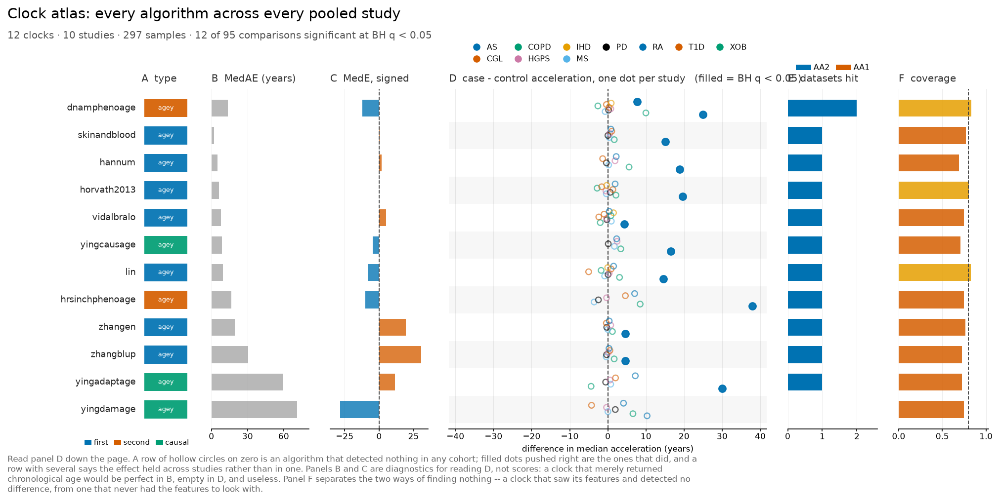

Read panel D down the page. A row of hollow circles on zero is an algorithm that detected nothing in any cohort; filled dots pushed right are the ones that did, and a row with several says the effect held across studies rather than in one. Panels B and C are diagnostics for reading D, not scores: a clock that merely returned chronological age would be perfect in B, empty in D, and useless. Panel F separates the two ways of finding nothing -- a clock that saw its features and detected no difference, from one that never had the features to look with.

`plot.clock_atlas()` in Python.

## Is the clock calibrated

Before any biology: does the prediction track chronological age, and where does it drift.

### Predicted against chronological age

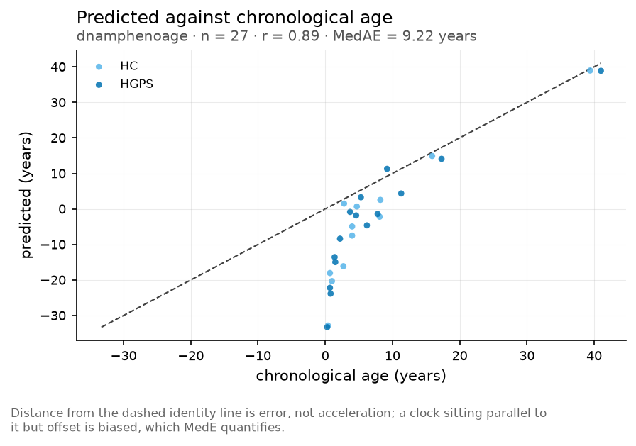

Distance from the dashed identity line is error, not acceleration; a clock sitting parallel to it but offset is biased, which MedE quantifies.

`plot.ba_vs_ca()` in Python.

### Agreement across the age range

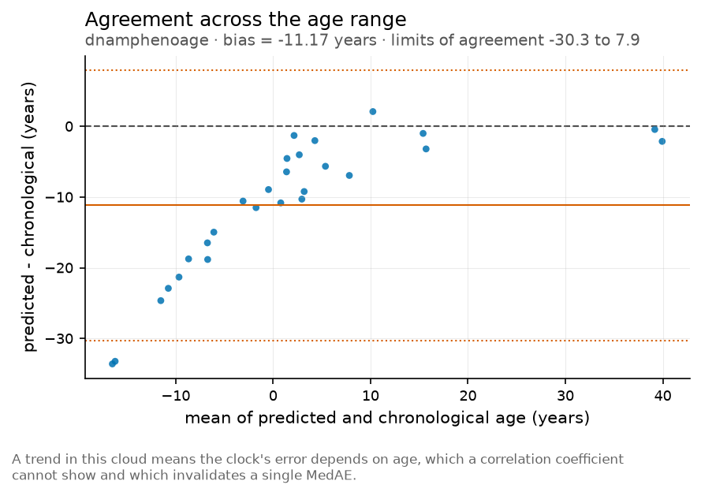

A trend in this cloud means the clock's error depends on age, which a correlation coefficient cannot show and which invalidates a single MedAE.

`plot.bland_altman()` in Python.

### Residual against chronological age

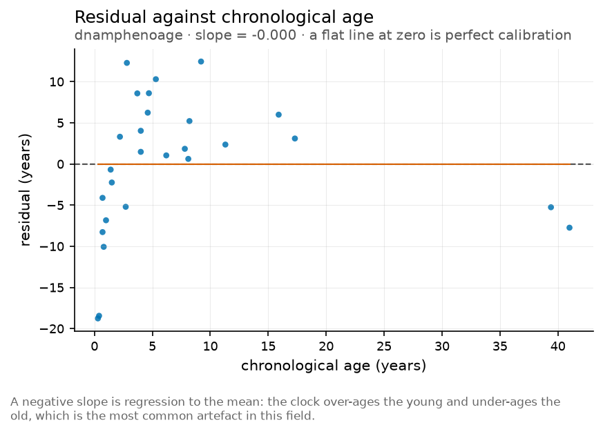

A negative slope is regression to the mean: the clock over-ages the young and under-ages the old, which is the most common artefact in this field.

`plot.calibration()` in Python.

## Age acceleration

The residual after age is removed, by group and across studies.

### Acceleration group

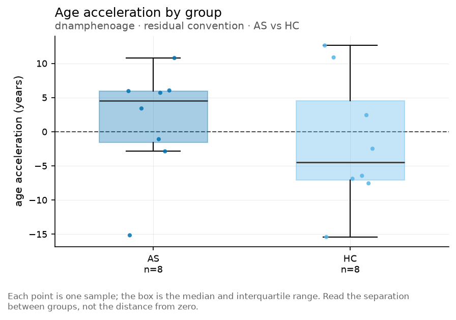

`plot.acceleration_group()` in Python.

### Distribution of age acceleration

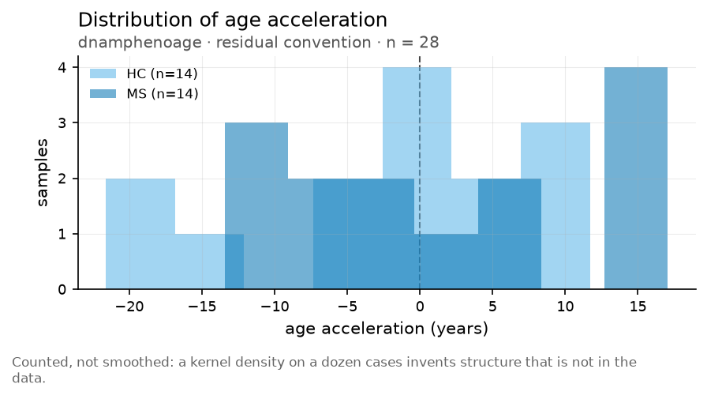

Counted, not smoothed: a kernel density on a dozen cases invents structure that is not in the data.

`plot.acceleration_density()` in Python.

### Age acceleration across clocks and samples

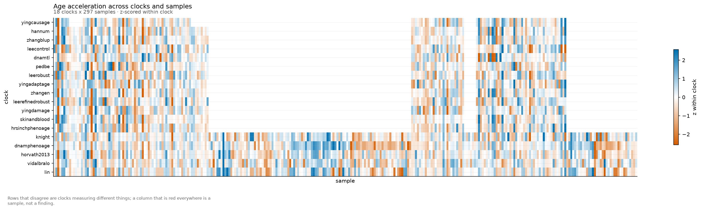

Rows that disagree are clocks measuring different things; a column that is red everywhere is a sample, not a finding.

`plot.acceleration_heatmap()` in Python.

### Effect of condition on age acceleration


Intervals crossing zero are the honest majority. Width tracks sample size, so a wide interval far from zero is a small study, not a large effect.

`plot.forest()` in Python.

## Outcomes

Whether acceleration predicts anything that happens to a person.

### Survival by age acceleration

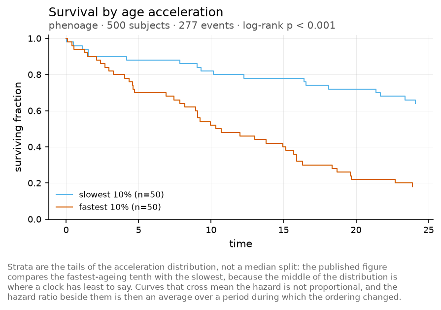

Strata are the tails of the acceleration distribution, not a median split: the published figure compares the fastest-ageing tenth with the slowest, because the middle of the distribution is where a clock has least to say. Curves that cross mean the hazard is not proportional, and the hazard ratio beside them is then an average over a period during which the ordering changed.

`plot.kaplan_meier()` in Python.

### Association with age acceleration

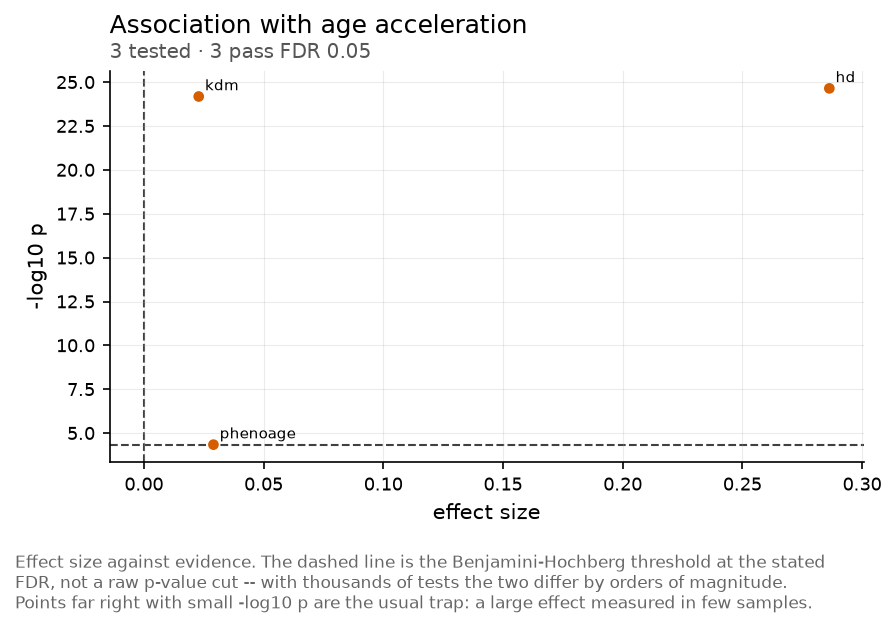

Effect size against evidence. The dashed line is the Benjamini-Hochberg threshold at the stated FDR, not a raw p-value cut -- with thousands of tests the two differ by orders of magnitude. Points far right with small -log10 p are the usual trap: a large effect measured in few samples.

`plot.volcano()` in Python.

## How the clocks relate

Twenty clocks are not twenty measurements. These show how much they share -- of their features, and of their answers.

### Agreement between clocks

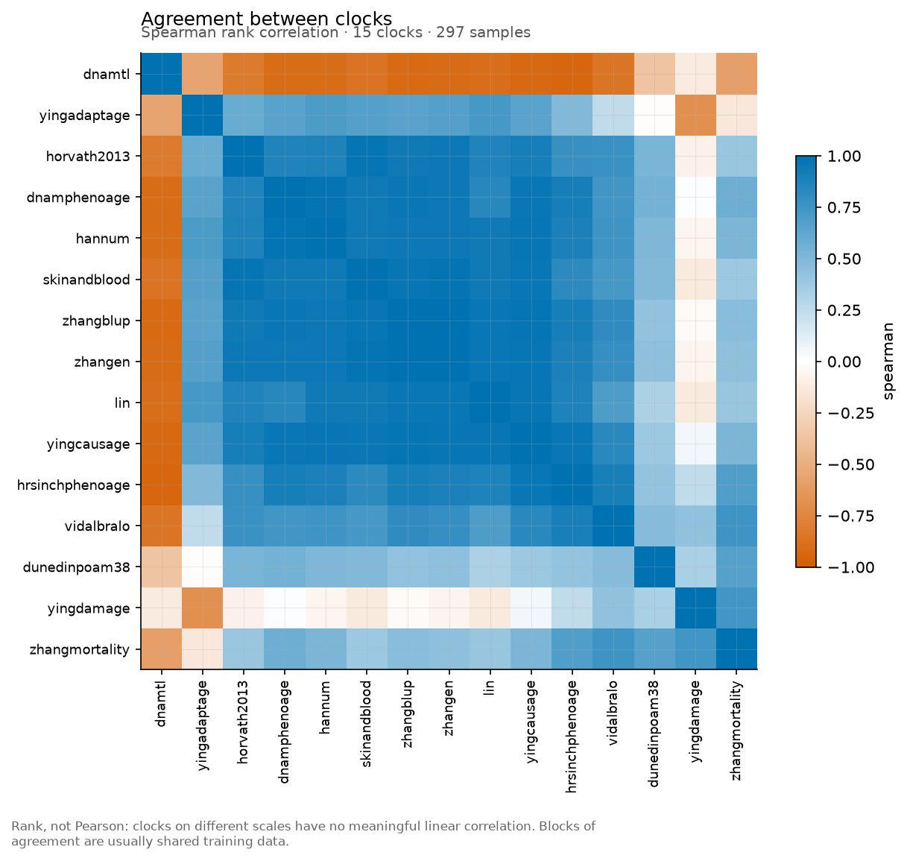

Rank, not Pearson: clocks on different scales have no meaningful linear correlation. Blocks of agreement are usually shared training data.

`plot.clock_corr()` in Python.

### Feature sharing between clocks


Chord width is the number of CpGs two clocks have in common. This is the answer to the question the correlation heatmap raises: clocks agree partly because they measure the same biology and partly because they are built from the same probes.

`plot.clock_chord()` in Python.

### Multi-clock profile

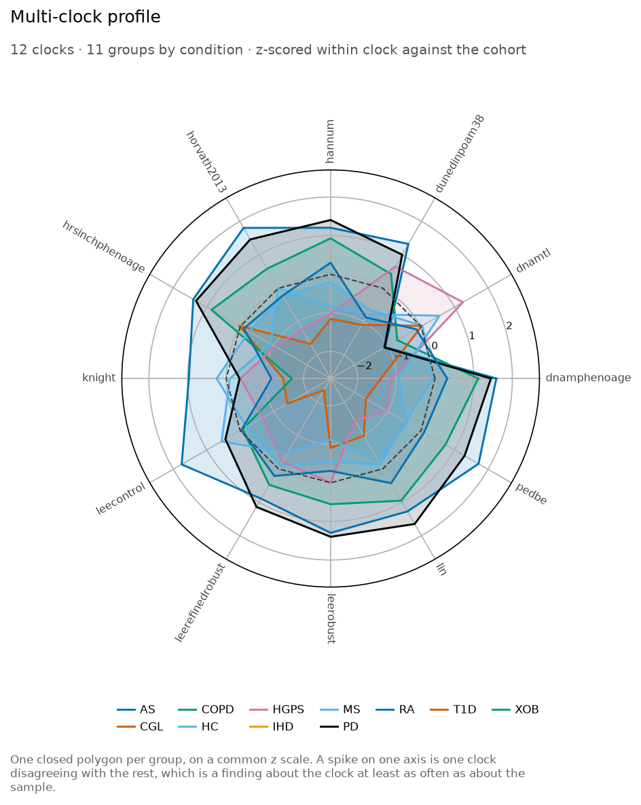

One closed polygon per group, on a common z scale. A spike on one axis is one clock disagreeing with the rest, which is a finding about the clock at least as often as about the sample.

`plot.clock_radar()` in Python.

### Samples in clock space

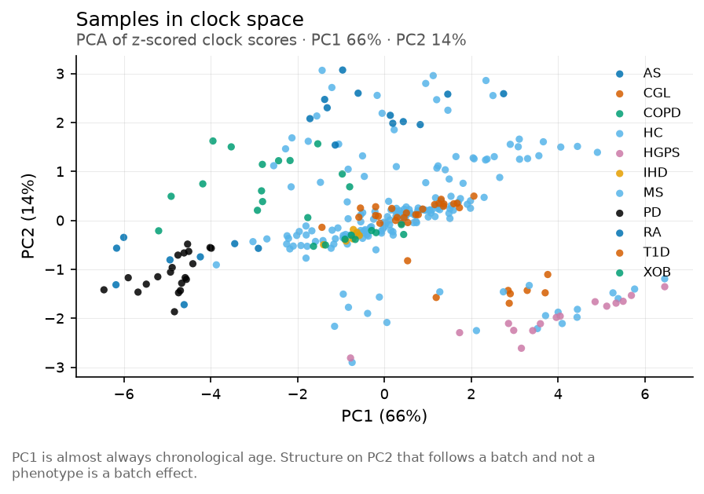

PC1 is almost always chronological age. Structure on PC2 that follows a batch and not a phenotype is a batch effect.

`plot.clock_pca()` in Python.

## Benchmarking

AA1 and AA2 against the ComputAgeBench conditions, and the error-versus-bias tradeoff that decides the ranking.

### Datasets detected per clock

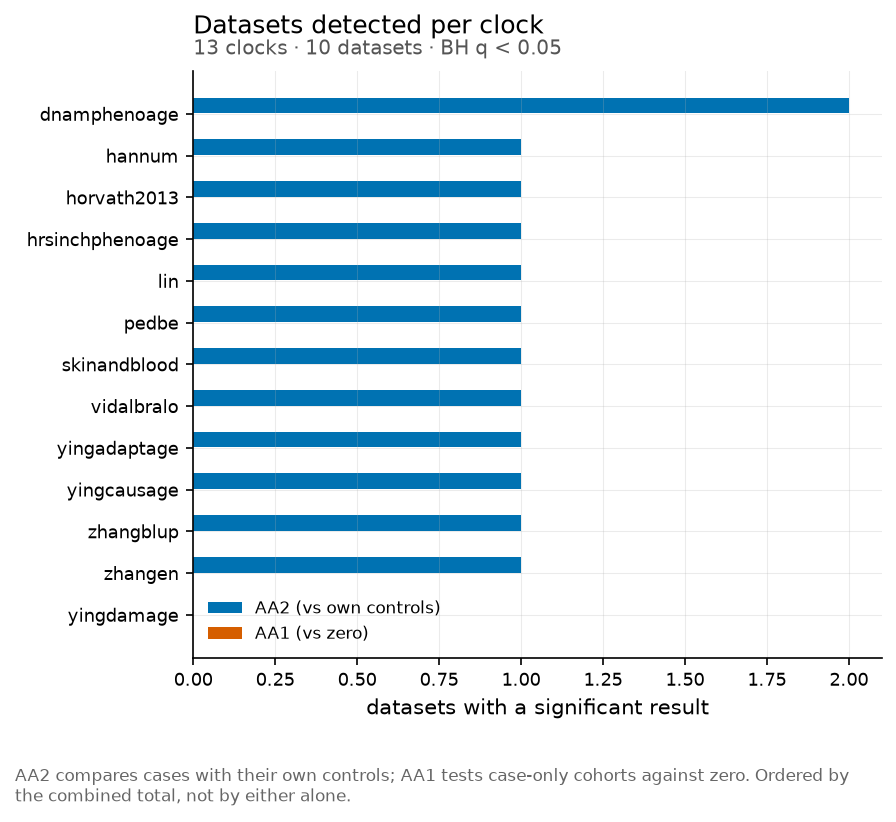

AA2 compares cases with their own controls; AA1 tests case-only cohorts against zero. Ordered by the combined total, not by either alone.

`plot.benchmark_bars()` in Python.

### Error against bias on healthy controls

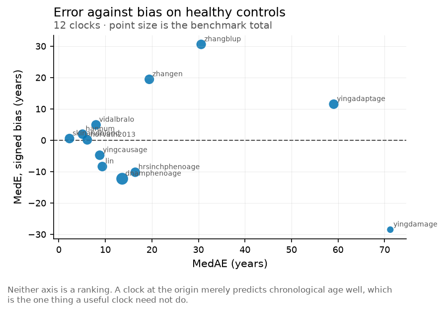

Neither axis is a ranking. A clock at the origin merely predicts chronological age well, which is the one thing a useful clock need not do.

`plot.benchmark_error_bias()` in Python.

### Effect size per clock and dataset

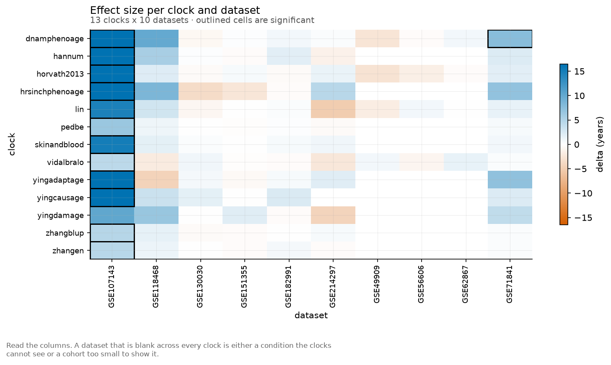

Read the columns. A dataset that is blank across every clock is either a condition the clocks cannot see or a cohort too small to show it.

`plot.benchmark_heatmap()` in Python.

## Data quality

Drawn before the results, because a coverage problem invalidates everything after it.

### Feature coverage per clock

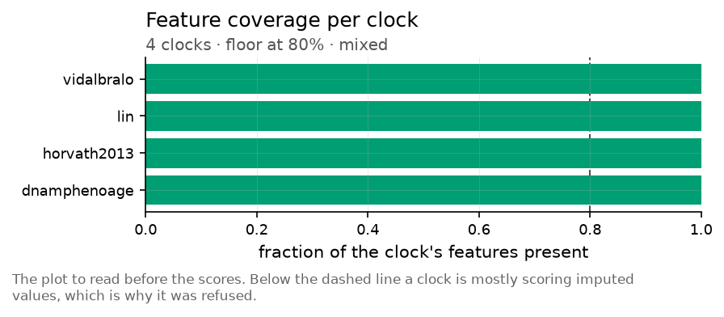

The plot to read before the scores. Below the dashed line a clock is mostly scoring imputed values, which is why it was refused.

`plot.coverage_bar()` in Python.

### Missing values per sample


One sample far to the right is a failed array; a shifted whole cohort is a probe filter someone applied upstream.

`plot.missingness()` in Python.

### Beta value distribution per sample

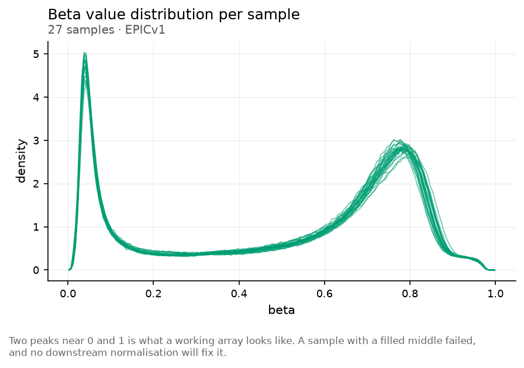

Two peaks near 0 and 1 is what a working array looks like. A sample with a filled middle failed, and no downstream normalisation will fix it.

`plot.beta_density()` in Python.

### Platform

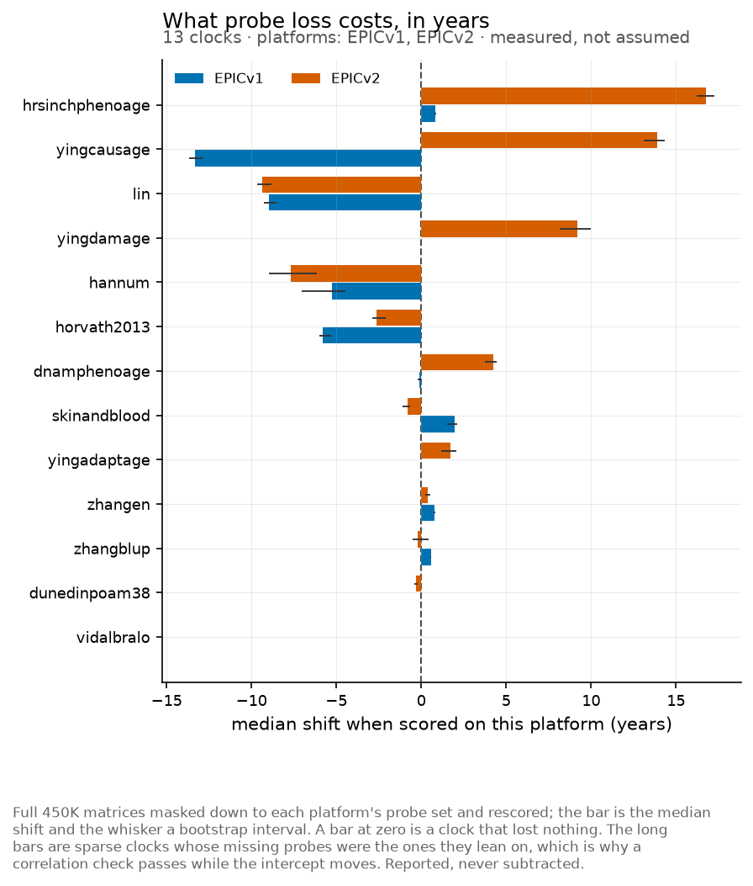

`plot.platform()` in Python.

### Study

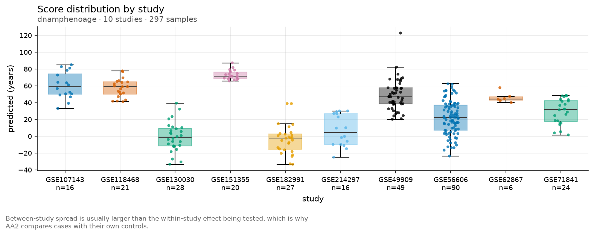

`plot.study()` in Python.

## Other

Figures not yet placed in a section above.

### Does the difference hold up across clocks?

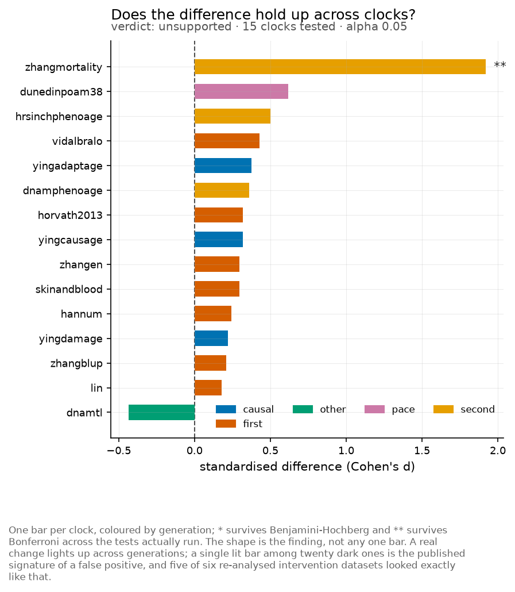

One bar per clock, coloured by generation; * survives Benjamini-Hochberg and ** survives Bonferroni across the tests actually run. The shape is the finding, not any one bar. A real change lights up across generations; a single lit bar among twenty dark ones is the published signature of a false positive, and five of six re-analysed intervention datasets looked exactly like that.

`plot.consensus_plot()` in Python.

### What probe loss costs, in years


Full 450K matrices masked down to each platform's probe set and rescored; the bar is the median shift and the whisker a bootstrap interval. A bar at zero is a clock that lost nothing. The long bars are sparse clocks whose missing probes were the ones they lean on, which is why a correlation check passes while the intercept moves. Reported, never subtracted.

`plot.platform_bias()` in Python.

### How much of each score is the assay

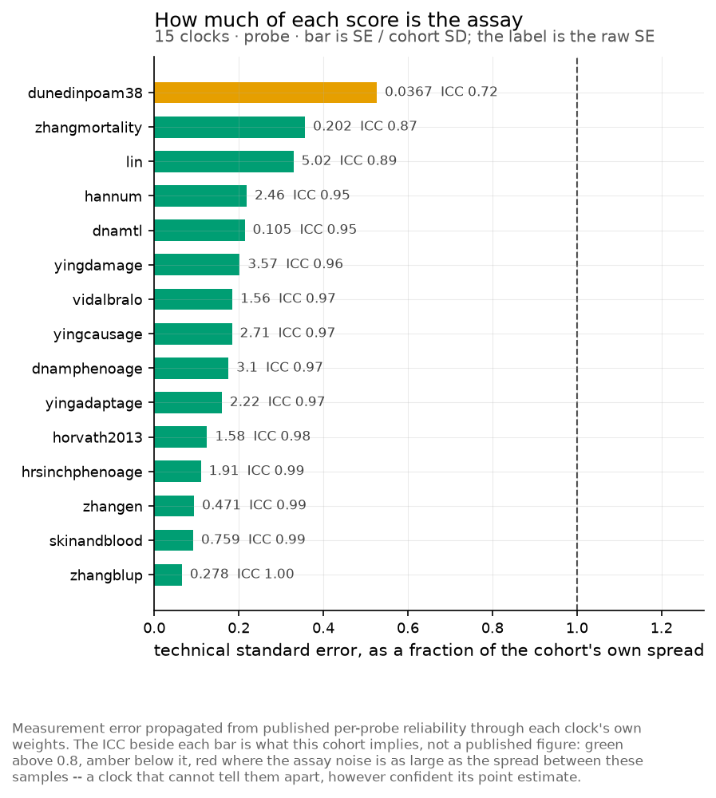

Measurement error propagated from published per-probe reliability through each clock's own weights. The ICC beside each bar is what this cohort implies, not a published figure: green above 0.8, amber below it, red where the assay noise is as large as the spread between these samples -- a clock that cannot tell them apart, however confident its point estimate.

`plot.reliability_forest()` in Python.

### Scores with the uncertainty they carry

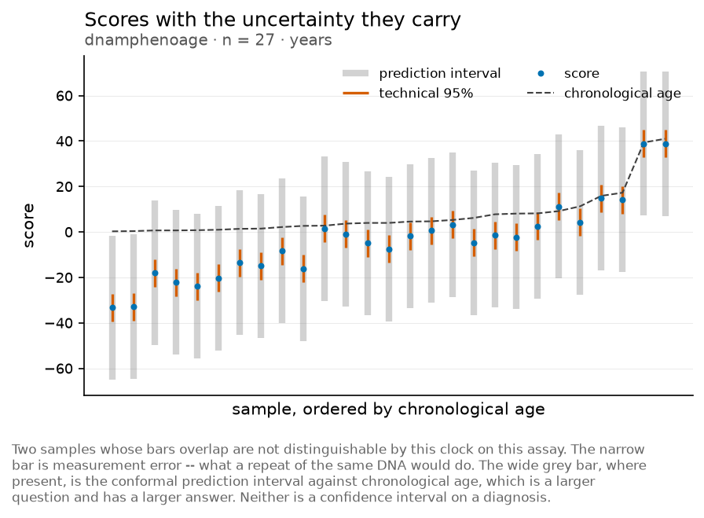

Two samples whose bars overlap are not distinguishable by this clock on this assay. The narrow bar is measurement error -- what a repeat of the same DNA would do. The wide grey bar, where present, is the conformal prediction interval against chronological age, which is a larger question and has a larger answer. Neither is a confidence interval on a diagnosis.

`plot.score_interval()` in Python.


---

26 figures. Every one is also written per dataset under `test/output_figures/<group>/<dataset>/` when the full corpus run is executed; the gallery keeps one representative of each type so a reader does not have to fetch 586 MB to see them.
