# FALCONAge test results

What the package actually produces when it is run against the public corpus in
[data/](data/README.md), and what those numbers mean.

<!-- BEGIN GENERATED: stamp -->
_Generated by `test/run_all.py` on 2026-08-08 08:54 UTC · FALCONAge 1.0.0 · registry 1.0.0 · numpy on cpu._
<!-- END GENERATED: stamp -->

Every table below marked *generated* is written by [`run_all.py`](run_all.py) from the run itself.
The prose around them is written by hand and is updated when the numbers move. If a table and its
interpretation disagree, the table is right and the prose is stale - say so in an issue.

## Running it

Every command below is run from the repository root, and every one of them was used to produce
what is on this page. On Windows PowerShell replace `"$PWD"` with `"${PWD}"`.

```bash
# 1. the images
docker build -f docker/Dockerfile.testdata -t falconage-testdata:1.0.0 .
docker build -f docker/Dockerfile.cpu      -t falconage:1.0.0-cpu      .

# 2. the corpus: 33 files, 586 MB. `plan` transfers nothing and prints every
#    URL and byte count, which is how you find out before rather than after.
docker run --rm -v "$PWD/test/data:/data" falconage-testdata:1.0.0 plan
docker run --rm -v "$PWD/test/data:/data" falconage-testdata:1.0.0 python
docker run --rm -v "$PWD/test/data:/data" falconage-testdata:1.0.0 verify

# 3. everything: every clock on every dataset, every figure, every table below
docker run --rm -v "$PWD:/work" -w /work falconage:1.0.0-cpu \
  python test/run_all.py

# or one group at a time
docker run --rm -v "$PWD:/work" -w /work falconage:1.0.0-cpu \
  python test/run_all.py --groups bench,epicv2
```

The two unit suites, in the same image, so a failure is not an artefact of a dev machine:

```bash
docker run --rm -v "$PWD:/work" -w /work falconage:1.0.0-cpu python -m pytest python/tests -q
docker run --rm -v "$PWD:/work" -w /work falconage:1.0.0-cpu Rscript -e 'testthat::test_local("r")'
```

And the GPU verification, which reproduces every number in [../docs/gpu.md](../docs/gpu.md) —
device resolution, CPU-versus-GPU agreement, the speed table and the profile behind it. It stops
after the first step with an explanation on a machine with no CUDA device:

```bash
docker build -f docker/Dockerfile.cuda -t falconage:1.0.0-cuda .
docker run --rm --gpus all -v "$PWD:/work" -w /work falconage:1.0.0-cuda \
  python test/gpu_check.py
```

Without Docker, the same three scripts run against a local install: `python test/run_all.py`,
`python -m pytest python/tests`, `python test/gpu_check.py`.

Outputs land in `test/output/<group>/<dataset>/` and are **overwritten on every run**. That is
deliberate: an output tree that accumulates history is one nobody prunes and everybody stops
trusting. The tree is excluded by `.gitignore` except for this file.

```
test/output/
├── bench/GSE107143/    scores_wide.csv scores_long.csv coverage.csv
│                       acceleration_residual.csv agreement_spearman.csv
│                       run_manifest.json report.html
├── bench/_combined/    benchmark_summary.csv benchmark_per_dataset.csv
├── clinical/synthetic/ scores_wide.csv run_manifest.json
├── epicv2/GSE330325/   scores_wide.csv coverage.csv run_manifest.json
├── gestational/GSE66459/  vs_recorded_gestational_age.csv
├── idat/raw/           intensities.csv
├── mammalian/GSE184222/   scores_wide.csv run_manifest.json
├── mouse/GSE80672/     coverage_filter.csv betas_head.csv
└── registry/catalogue/ clocks.csv tier_a.csv tier_c.csv
```

`run_manifest.json` sits beside every result and records the FALCONAge version, the registry
version, the device and dtype, and the SHA-256 of every coefficient file used. Two runs reporting
the same score either used the same coefficients or the manifest says they did not.

---

## The registry

<!-- BEGIN GENERATED: registry -->
| clocks | tier_A | tier_B | tier_C | untraced | coefficients_bundled | registry_version |
|---|---|---|---|---|---|---|
| 161 | 23 | 110 | 28 | 156 | 20 | 1.0.0 |
<!-- END GENERATED: registry -->

**How to read it.** 161 clocks are catalogued; the tier says what you can do with each. Tier A
ships coefficients inside the wheel and runs offline. Tier B is catalogued metadata with no
coefficients, because no primary source has been traced for it - deliberately, since copying a
coefficient set out of another package without knowing its origin is how the field's known
paper-versus-implementation discrepancies spread. Tier C is a licensing decision by the clocks'
authors, not by us.

`untraced` counts clocks whose coefficient provenance is not established. It is large, and it is
supposed to be visible rather than quietly rounded away.

---

## Methylation benchmark

### The ten studies

<!-- BEGIN GENERATED: bench_inputs -->
| dataset | n | platform | probes | clocks_scored | skipped | conditions | age_range | figures | seconds |
|---|---|---|---|---|---|---|---|---|---|
| GSE107143 | 16 | 450K | 460295 | 20 | 138 | AS=8, HC=8 | 32-88 | 27 | 2.8 |
| GSE118468 | 21 | 450K | 485512 | 20 | 138 | COPD=15, HC=6 | 49-82 | 29 | 4 |
| GSE130030 | 28 | 450K | 471336 | 20 | 138 | HC=14, MS=14 | 20-65 | 27 | 3.7 |
| GSE151355 | 20 | 450K | 484147 | 20 | 138 | PD=20 | 74-91 | 25 | 3.8 |
| GSE182991 | 27 | EPICv1 | 825177 | 20 | 138 | HC=12, HGPS=15 | 0-41 | 28 | 7.1 |
| GSE214297 | 16 | ? | 518474 | 19 | 139 | CGL=7, HC=9 | 1-48 | 28 | 3.5 |
| GSE49909 | 49 | 27K | 27578 | 5 | 153 | HC=40, XOB=9 | 29-85 | 28 | 0.6 |
| GSE56606 | 90 | 27K | 27578 | 5 | 153 | HC=63, T1D=27 | 16-68 | 28 | 0.6 |
| GSE62867 | 6 | 27K | 27578 | 5 | 153 | IHD=6 | 48-67 | 23 | 0.4 |
| GSE71841 | 24 | 450K | 485512 | 20 | 138 | HC=12, RA=12 | 23-57 | 28 | 6.1 |
<!-- END GENERATED: bench_inputs -->

**How to read it.** `clocks_scored` is what survived the 50% coverage floor on that platform, and
it is the single most informative column here. The 450K and EPIC studies support roughly twenty
clocks; the 27K studies support a handful, because 27,578 probes cannot cover a clock built on
450,000. That is not a defect being reported - it is the coverage check doing its job instead of
returning a confident number computed mostly from imputed values.

`skipped` counts every catalogued clock that could not run, with a reason recorded per clock in
`coverage.csv`: scaffold, no traced source, or below the floor.

### AA1 / AA2

<!-- BEGIN GENERATED: benchmark_counts -->
**13 of 102 comparisons significant** at BH q < 0.05, across 10 datasets and 13 clocks.
<!-- END GENERATED: benchmark_counts -->

<!-- BEGIN GENERATED: benchmark -->
| clock | AA2 | AA1 | MedAE | MedE | total |
|---|---|---|---|---|---|
| dnamphenoage | 2 | 0 | 13.621 | -12.253 | 2 |
| hannum | 1 | 0 | 5.095 | 1.962 | 1 |
| horvath2013 | 1 | 0 | 6.115 | 0.139 | 1 |
| hrsinchphenoage | 1 | 0 | 16.429 | -10.182 | 1 |
| lin | 1 | 0 | 9.352 | -8.365 | 1 |
| pedbe | 1 | 0 | 28.186 | -28.186 | 1 |
| skinandblood | 1 | 0 | 2.296 | 0.563 | 1 |
| vidalbralo | 1 | 0 | 8 | 4.936 | 1 |
| yingadaptage | 1 | 0 | 59.077 | 11.529 | 1 |
| yingcausage | 1 | 0 | 8.793 | -4.751 | 1 |
| zhangblup | 1 | 0 | 30.59 | 30.59 | 1 |
| zhangen | 1 | 0 | 19.446 | 19.446 | 1 |
| yingdamage | 0 | 0 | 71.23 | -28.486 | 0 |
<!-- END GENERATED: benchmark -->

**How to read it.** `AA2` counts datasets where the condition group accelerated significantly
relative to its own controls. `AA1` counts case-only datasets where acceleration was above zero.
`MedAE` and `MedE` are the absolute and signed error against chronological age, measured on
healthy controls only, and `MedE` discounts the AA1 credit:

```
total = AA2 + AA1 * (1 - max(0, MedE) / MedAE)
```

Without that discount a clock that simply over-predicts everybody sweeps AA1, because every group
looks accelerated when the baseline is wrong.

`MedAE` is reported and never ranked on. A perfect chronological oracle would score zero on it
and be useless - it would have no age acceleration left to detect anything with. That is the
whole reason the field moved to AA1/AA2, and a benchmark that sorted on MedAE would rank the
least useful clock first.

### Which comparisons reached significance

<!-- BEGIN GENERATED: benchmark_significant -->
| clock | dataset | condition | test | n_case | n_control | delta | q |
|---|---|---|---|---|---|---|---|
| dnamphenoage | GSE107143 | AS | AA2 | 8 | 8 | 25.012 | 0.0017 |
| dnamphenoage | GSE71841 | RA | AA2 | 12 | 12 | 7.7222 | 0.0122 |
| hannum | GSE107143 | AS | AA2 | 8 | 8 | 18.9088 | 0.0157 |
| horvath2013 | GSE107143 | AS | AA2 | 8 | 8 | 19.5728 | 0.0122 |
| hrsinchphenoage | GSE107143 | AS | AA2 | 8 | 8 | 37.8935 | 0.0017 |
| lin | GSE107143 | AS | AA2 | 8 | 8 | 14.574 | 0.0092 |
| pedbe | GSE107143 | AS | AA2 | 8 | 8 | 6.4819 | 0.0017 |
| skinandblood | GSE107143 | AS | AA2 | 8 | 8 | 15.0765 | 0.022 |
| vidalbralo | GSE107143 | AS | AA2 | 8 | 8 | 4.3083 | 0.034 |
| yingadaptage | GSE107143 | AS | AA2 | 8 | 8 | 30.0587 | 0.0017 |
| yingcausage | GSE107143 | AS | AA2 | 8 | 8 | 16.5628 | 0.0248 |
| zhangblup | GSE107143 | AS | AA2 | 8 | 8 | 4.6378 | 0.0248 |
| zhangen | GSE107143 | AS | AA2 | 8 | 8 | 4.5251 | 0.0248 |
<!-- END GENERATED: benchmark_significant -->

**How to read it.** Two patterns matter here, and they pull in opposite directions.

**Ankylosing spondylitis carries almost every hit.** Nearly every age-scale clock separates AS
cases from their controls in GSE107143, at deltas of ten to forty years on eight-versus-eight
samples. Deltas that large on samples that small should be read as a real but poorly estimated
effect: the direction is trustworthy, the magnitude is not.

**Progeria produces nothing, on any clock.** GSE182991 has fifteen Hutchinson-Gilford progeria
patients against twelve age-matched controls, and no clock in the registry separates them. This
is the published result, not a failure of the implementation - Horvath's own work found progeroid
syndromes have near-normal DNAm age. It is the most useful row in the table precisely because it
is empty: a benchmark built only from conditions the clocks already detect measures nothing, and
a pipeline that "found" progeria acceleration would be reporting a bug.

The gap between those two is the benchmark working.

---

## EPIC v2 probe-suffix aggregation

<!-- BEGIN GENERATED: epicv2 -->
| probes_raw | probes_after_aggregation | collapsed | horvath_coverage_raw | horvath_coverage_aggregated | clocks_scored |
|---|---|---|---|---|---|
| 888987 | 882947 | 6040 | 0 | 0.9603 | 20 |
<!-- END GENERATED: epicv2 -->

**How to read it.** Illumina renamed `cg00000029` to `cg00000029_TC21` on EPIC v2. Every clock in
the registry matches on the bare identifier, so before aggregation the overlap with Horvath2013 is
near zero - and the failure is silent, because the imputation step then fills every feature and
the clock returns a plausible number computed entirely from imputed values.

`collapsed` is how many probes were merged: roughly five thousand loci carry two or three
differently-suffixed probes, which are averaged. The coverage jump from `horvath_coverage_raw` to
`horvath_coverage_aggregated` is the whole argument for the step being mandatory rather than
optional.

---

## Gestational clocks

<!-- BEGIN GENERATED: gestational -->
| clock | median_predicted_weeks | median_recorded_weeks | cor_with_recorded | medae_weeks |
|---|---|---|---|---|
| knight | 37.93 | 37.29 | 0.953 | 0.98 |
| leecontrol | 38.58 | 37.29 | 0.962 | 2.06 |
| leerobust | 36.66 | 37.29 | 0.864 | 2.36 |
| leerefinedrobust | 37.75 | 37.29 | 0.928 | 1.76 |
<!-- END GENERATED: gestational -->

**How to read it.** GSE66459 is 11 preterm and 11 term cord blood samples. The four gestational
clocks predict weeks; GEO records the gestational age in **days**. `median_recorded_weeks` is the
recorded value converted by hand for this comparison - FALCONAge does not convert it silently,
which is the entire point of the units module. A factor of seven applied by accident produces a
number that looks like a plausible age and is not one.

`cor_with_recorded` is modest and should be. Twenty-two samples with a compressed gestational
range is not a validation cohort; what this table demonstrates is that the clocks run, land in
the right range, and are being compared against a value in the right unit.

---

## Mammalian array: coverage is not validity

<!-- BEGIN GENERATED: mammalian -->
| dataset | species | n | probes | horvath_coverage | median_horvath | species_warning |
|---|---|---|---|---|---|---|
| GSE184222 | Equus grevyi | 12 | 37554 | 0.9632 | 26.86 | True |
| GSE184224 | Homo sapiens | 17 | 37554 | 0.9632 | 2.92 | False |
<!-- END GENERATED: mammalian -->

**How to read it.** This is the most instructive result in the whole run.

The mammalian methylation array was designed around CpGs conserved across mammals, and it carries
about 96% of Horvath2013's 353 probes. So a Grevy's zebra scores at *higher* feature coverage than
many human 450K datasets, and Horvath2013 returns a confident number for it. Nothing in the
arithmetic can notice: the probes are present, the values are in range, the dot product is
well-defined.

Only the declared species can catch it, which is why `FalconData` carries one and why
`species_warning` is a column in this table. The human dataset on the same array is the control:
same probes, same pipeline, no warning.

If you take one thing from these results, take this: **feature coverage answers "can this clock
run", never "should it".**

---

## Mouse RRBS

<!-- BEGIN GENERATED: mouse -->
| samples | shared_sites | sites_at_cov1 | sites_at_cov5 | sites_at_cov20 | series_age_field | series_age_min | series_age_max |
|---|---|---|---|---|---|---|---|
| 4 | 1976975 | 1976975 | 1875045 | 1120532 | age (years) | 0.67 | 35 |
<!-- END GENERATED: mouse -->

**How to read it.** Two things this exercises that no array file can.

**Coverage-weighted beta.** A site read four times and a site read four hundred times are not the
same measurement. `sites_at_cov1` versus `sites_at_cov20` shows how much of the file is thin
coverage; keeping it would let the clock report sequencing depth as biology.

**Units that lie.** `series_age_field` is what GEO calls the age column and `series_age_max` is
the largest value in it. A mouse does not live 35 years - the values are months, mislabelled at
submission. This is a real published series, not a contrived example, and it is the best argument
in the corpus for declaring units rather than inferring them.

Sites are keyed by the NCBI `gi` accessions the submitter used, not by `chr:pos`. FALCONAge keeps
them verbatim: remapping would need an assembly and a choice about which one, and making that
choice silently is how a coordinate-keyed clock matches nothing while appearing to match
something.

---

## Raw IDATs

<!-- BEGIN GENERATED: idat -->
| platform | sample | addresses | grn_median | red_median | channels_identical |
|---|---|---|---|---|---|
| epicv1 | GSM5548192 | 1051815 | 4028 | 4184 | False |
| epicv1 | GSM5548193 | 1051815 | 4036 | 3603 | False |
| epicv2 | GSM9723838 | 1105209 | 2564 | 1846 | False |
| epicv2 | GSM9723839 | 1105209 | 2718 | 1621 | False |
<!-- END GENERATED: idat -->

**How to read it.** Two EPIC v1 and two EPIC v2 samples, both channels each. `channels_identical`
must be `False` - a parser that returned the same buffer for Grn and Red would produce beta values
of exactly 0.5 everywhere and look superficially fine.

This is the only input path FALCONAge controls end to end. Everything else in the corpus is
somebody else's beta matrix, normalised by a pipeline whose choices are not recorded.

---

## Clinical chemistry

<!-- BEGIN GENERATED: clinical -->
| clock | median | cor_with_age | medae_vs_age |
|---|---|---|---|
| phenoage | 55.03 | 0.976 | 2.64 |
| kdm | -4.65 | 0.547 | 59.58 |
| hd | 2.98 | 0.323 |  |
<!-- END GENERATED: clinical -->

**How to read it.** Synthetic, and deliberately so on the Python side: NHANES ships as `.rda`,
which R reads natively and Python does not. The R suite (`r/tests/testthat/test-corpus.R`) runs
the same three clocks against the real NHANES III extract - 15,160 samples - through the same
Python core. What this table checks is the arithmetic on a cohort whose answers can be reasoned
about.

`phenoage` correlates strongly with age because it is dominated by its age term, exactly as
published. `kdm` recovers age from the biomarker panel and its correlation depends on how much
age signal those markers carry. `hd` has no `medae_vs_age` because it is a Mahalanobis distance,
not an age - the column is blank rather than filled with a meaningless number, which is the same
`scale_type` rule that stops `acceleration()` running on a pace clock.

---

## The figures

A run produces roughly five hundred PNGs - the same twenty-odd figure types, once per input. One
representative of each type is copied into [output_figures/gallery/](output_figures/gallery/),
chosen from the dataset that shows it best rather than from whichever ran first; the choices and
their reasons are in [gallery/SOURCES.md](output_figures/gallery/SOURCES.md). The gallery is the
only part of the output tree that is committed, so a reader sees the figures without first
downloading 586 MB and running the pipeline.

### Start here: every clock, every study, one figure


Six panels on one shared clock axis, ordered by benchmark total. Read it left to right: what the
clock predicts and on what scale, how many datasets it was scoreable on, its median coverage,
then the panel that matters - a dot per dataset showing the case-control effect, filled where
significant and hollow where not - then MedAE and the bias that discounts it.

The ordering is the argument. Clocks that detect real conditions rise to the top, and they are
not the clocks with the lowest median absolute error against chronological age. A perfect
chronological oracle would sort last on this figure, because it would have no age acceleration
left to detect anything with, which is the entire case for AA1/AA2 over MedAE.

### Per-clock accuracy

| | |
|---|---|
|  | 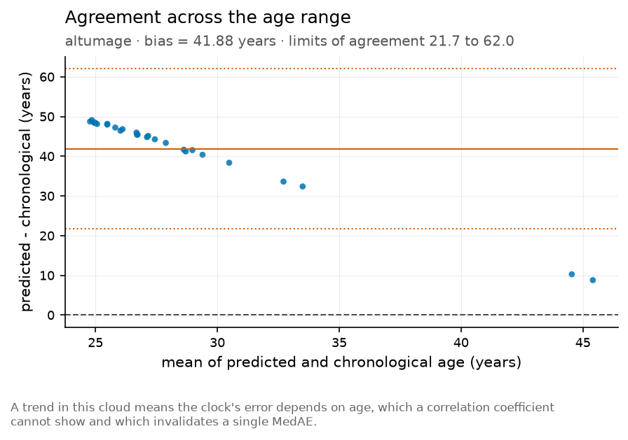 |

Left: predicted against chronological age with the identity line, on the widest age range in the
corpus (0–41). Right: the same data as error against mean, which is where regression dilution
becomes visible - every penalised clock compresses toward its training mean, so the error is
negative in the old and positive in the young and correlates with age. That slope is why
`acceleration(method = "residual")` exists, and why reporting only `BA − CA` on a cohort with a
wide age range is a mistake.


Binned observed against predicted. A clock can have a good correlation and still be uncalibrated
in the tails, which is exactly where paediatric and geriatric cohorts live.

### Case against control

| | |
|---|---|
| 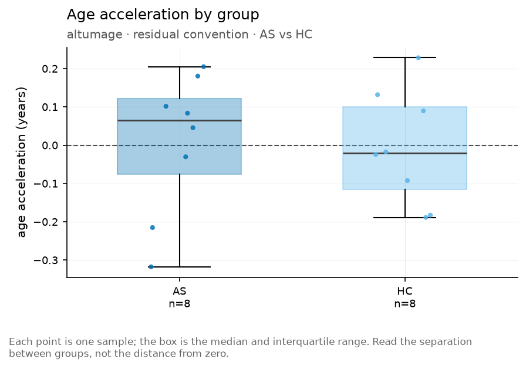 |  |

The AA2 test made visual, on the one condition every clock in the corpus detects and on a
balanced 14-vs-14 design. The density is worth reading alongside the summary: two groups can
differ in median while overlapping almost completely, and a p-value does not say which.

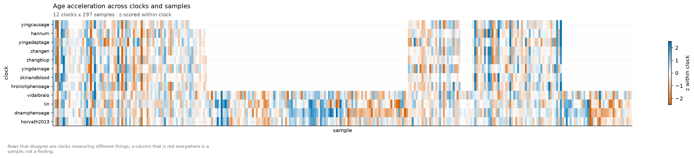

Clock × study. Rows that are uniformly warm are clocks with a positive bias rather than clocks
that detect things - compare against the bias column of the atlas before believing a row.

### Do the clocks agree, and why

| | |
|---|---|
| 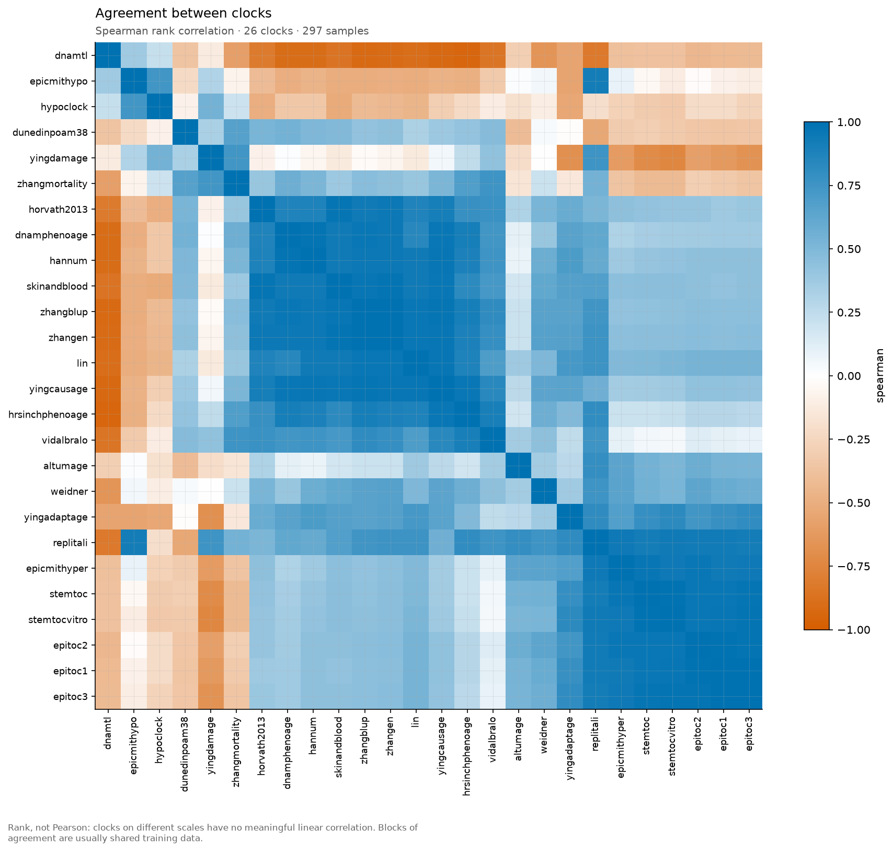 |  |

The heatmap says two clocks agree. The chord says how much of that agreement was built in: chord
width is the number of CpGs the two clocks literally have in common. A pair with a thick chord and
a high correlation has told you much less than a pair with a high correlation and no chord at all,
and the second kind is the interesting one.

| | |
|---|---|
|  | 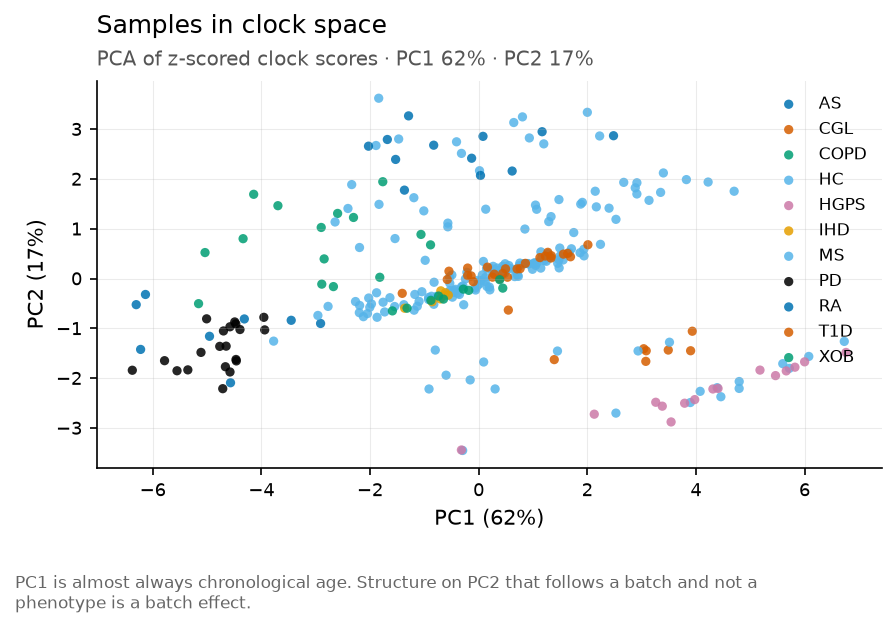 |

One closed polygon per condition on a common z scale, and the samples projected into clock space.
A spike on one radar axis is one clock disagreeing with the rest, which is a finding about the
clock at least as often as about the sample.

### Quality control, before the scores

| | |
|---|---|
| 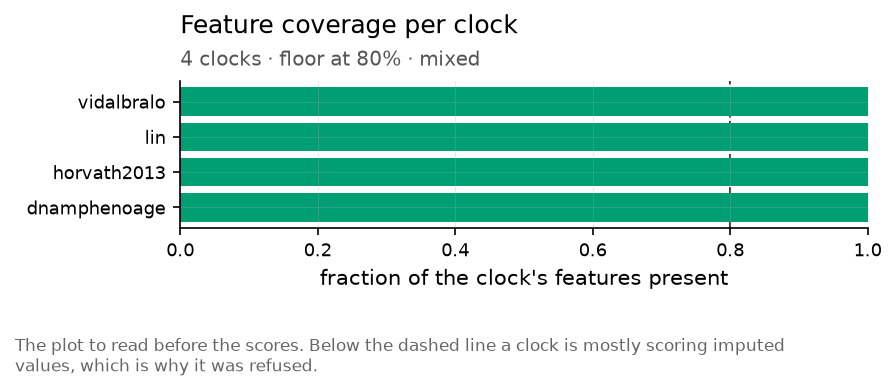 | 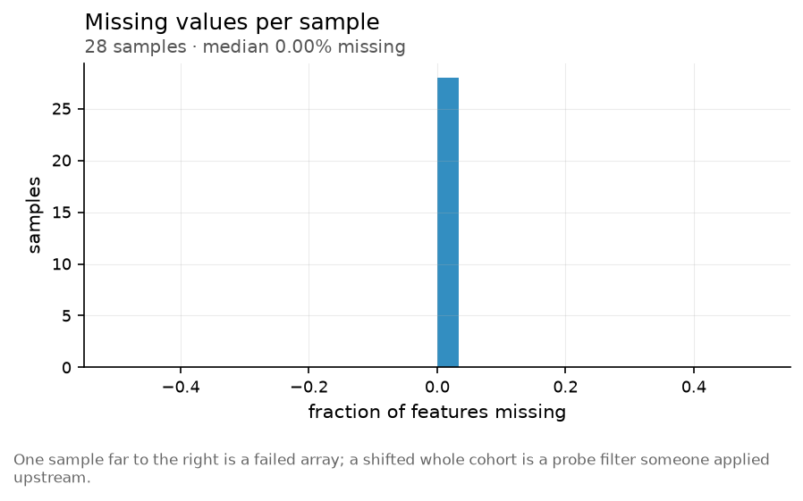 |

The figures to read first. Coverage is shown on the 27K series deliberately - that is the platform
where it bites, and where several clocks are refused rather than scored on mostly imputed values.

| | |
|---|---|
| 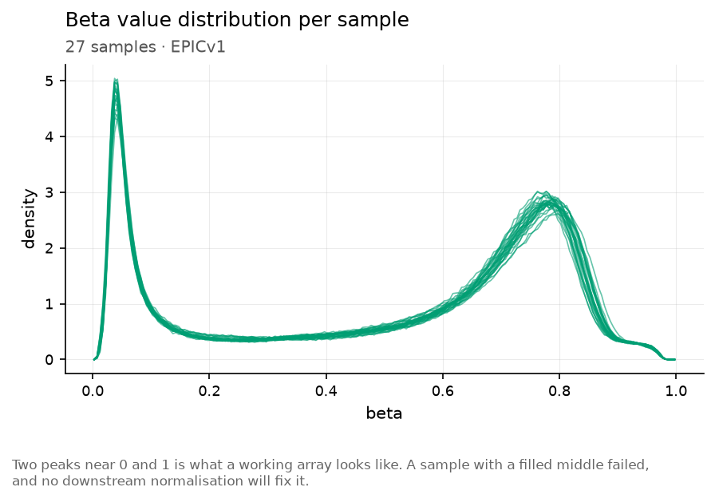 |  |

A methylation beta distribution should be bimodal near 0 and 1; anything else means the
normalisation is broken and no clock output downstream is worth reading. The study panel asks the
other QC question: is the batch bigger than the biology.

### The benchmark

| | |
|---|---|
| 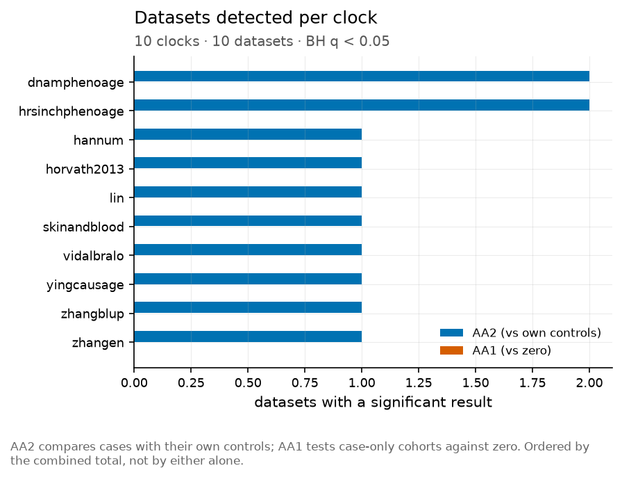 | 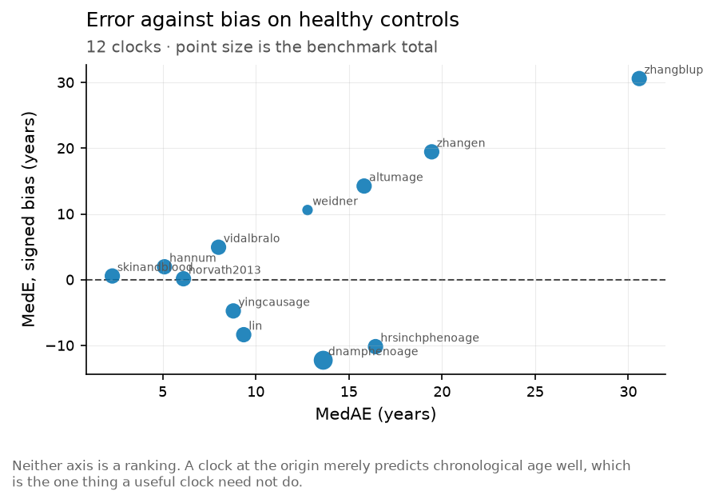 |

AA2 counts datasets where the condition cohort accelerated significantly against its own controls;
AA1 counts acceleration above zero with no control group. The second panel is the tradeoff the
total score encodes: a clock that simply over-predicts everyone sweeps AA1, so `MedE` on healthy
controls discounts the AA1 credit.

| | |
|---|---|
| 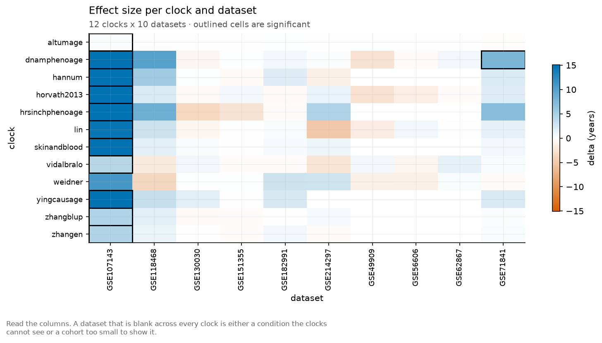 | 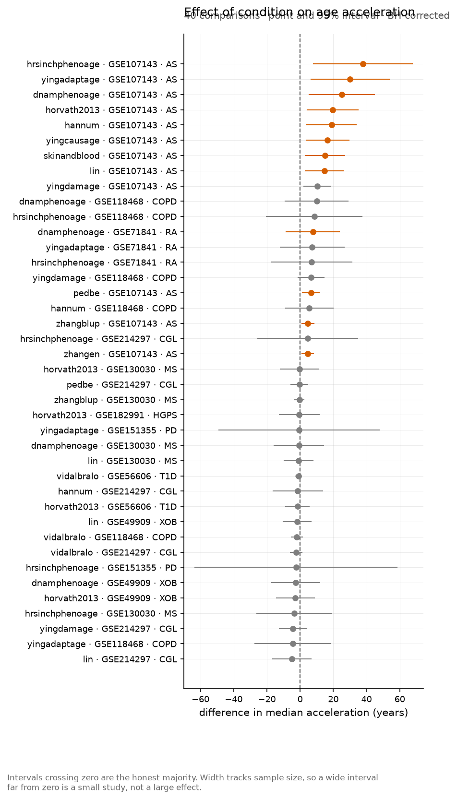 |

## What is not covered here

- **The 28 scaffold clocks.** Their feature alignment and tensor shapes are exercised by the unit
  suite with synthetic coefficients; they cannot produce a number without a licensed file.
- **FP64 gold-standard vectors.** The ComputAgeBench parquets are float32. Double-precision
  reference values have to come from the papers' own worked examples.
- **GPU.** No CUDA device in the test environment. The device resolution path is unit-tested;
  the kernels are not exercised.
- **Plate-level normalisation.** Four IDATs is not a plate.

## Test suites, separately

The tables above come from running the package. The correctness assertions live elsewhere:

```bash
cd python && python -m pytest tests -q      # 72 unit + 17 corpus integration
cd r && Rscript -e 'testthat::test_dir("tests/testthat")'
```

The R suite includes the conformance test that asserts R and Python scores are **bit-identical**,
tolerance exactly zero - not approximately equal, which is what a second implementation would
give and is the reason there is only one.
